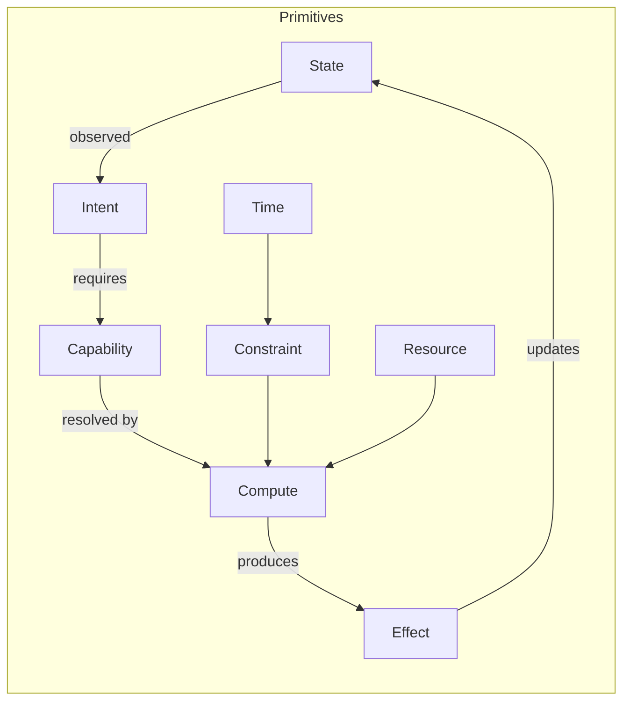
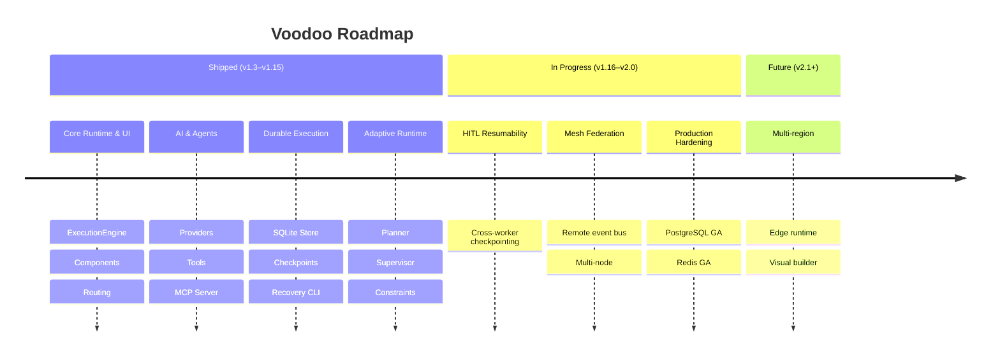

<picture>
  <source media="(prefers-color-scheme: dark)" srcset="docs/assets/voodoo-logo-white.png">
  
</picture>

# Voodoo

**The AI-native application framework for Python.**

[](https://pypi.org/project/voodoo-framework/)
[](https://www.python.org/downloads/)
[](LICENSE)
[](https://github.com/helderperez-dev/voodoo/actions/workflows/ci.yml)
[](https://pypi.org/project/voodoo-framework/)

Build reactive UIs, APIs, agents, background workers, realtime systems, MCP tools, and data-driven applications in **one Python runtime**. Built for the future of adaptive applications.

> Voodoo favors composition over configuration, Python over DSLs, adapters over
> lock-in, events over tightly coupled systems, and explicit capabilities over
> unrestricted AI autonomy.

---

## Table of Contents

- [Why Voodoo?](#why-voodoo)
- [Quick Start](#quick-start)
- [The AI SaaS App](#the-ai-saas-app)
- [What Makes Voodoo Different](#what-makes-voodoo-different)
- [Architectural Primitives](#architectural-primitives)
- [Features](#features)
- [Installation](#installation)
- [Configuration](#configuration)
- [Documentation](#documentation)
- [Examples](#examples)
- [Project Status & Roadmap](#project-status--roadmap)
- [Contributing](#contributing)
- [Security](#security)
- [License](#license)

---

## Why Voodoo?

Modern application development is fragmented. You assemble a frontend framework, a backend framework, a database, a queue, an event bus, an AI SDK, an auth system, a deployment pipeline — and spend more time gluing them together than building your product.

Voodoo asks: **what if all of that was one thing?**

Voodoo is **not** a wrapper around other frameworks. It's a unified runtime where UI, API, agents, workers, events, and data are first-class primitives that share a single execution model.

## Quick start

```bash
pip install voodoo-framework
voodoo new my_app
cd my_app
voodoo dev
```

Open `http://localhost:8000` — that's it. No npm, no bundler, no config files.

The scaffold produces only `app/page.py`, `voodoo.toml`, and `pyproject.toml` — nothing else. No `main.py`, no `.env`, no placeholder directories.

> **Want AI features?** Install with `pip install "voodoo-framework[ai]"` to add OpenAI, Anthropic, Gemini, and Ollama SDKs.

## The AI SaaS app

Here's a complete example exercising the full chain — UI → agent → tool → MCP → mesh → worker → database:

```python
from voodoo import (
    App,
    page,
    state,
    event,
    Agent,
    tool,
    Container,
    Heading,
    Text,
    Button,
    Card,
    Div,
    Table,
)

app = App()

# --- Data model ---
from voodoo import Model


class Lead(Model):
    name: str
    email: str
    status: str = "new"


# --- Tool (one definition, four consumers) ---
@tool
async def create_lead(name: str, email: str) -> str:
    """Create a new lead in the database."""
    lead = await Lead.create(name=name, email=email)
    return f"Created lead #{lead.id}: {name}"


# --- Agent with tool calling ---
agent = Agent(
    model="openai:gpt-4o",
    tools=["create_lead"],
    system_prompt="You are a sales assistant. Use tools to create leads.",
)

# --- Realtime mesh event ---
from voodoo.mesh import mesh


@mesh.on("lead.created")
async def notify_slack(payload):
    # Triggered when a lead is created
    print(f"New lead notification: {payload}")


# --- Reactive UI ---
leads = state([])


@page("/")
def dashboard():
    return Container(
        Heading("AI SaaS Dashboard", level=1),
        Card(
            Text("Ask the AI to create leads"),
            Button("Create Lead", onclick="vd.event('create_lead', 'btn')"),
        ),
        Div(
            Table(*leads.get()),
            id="leads-table",
        ),
    )


@event
async def create_lead(element_id, value):
    run = await agent.run("Create a lead for Ada Lovelace, ada@x.io")
    # Agent calls create_lead tool → DB insert → mesh event fires
    all_leads = await Lead.all()
    leads.set(all_leads)


if __name__ == "__main__":
    app.run()
```

## What makes Voodoo different

| Differentiator | What it means |
|---|---|
| **AI-native by design** | Agents, tools, and MCP are first-class primitives — not add-ons bolted on later |
| **Agents as application primitives** | `Agent()` sits next to `Button()` and `Card()` in your code |
| **Voodoo Mesh** | Unified event layer connecting UI, workers, agents, and applications |
| **One tool, many consumers** | A single `@tool` definition serves Python calls, agents, MCP, and mesh |
| **Observability everywhere** | Correlation IDs and telemetry built into every subsystem |
| **Unified runtime engine** | Every operation (HTTP, Agent, Tool, MCP, Worker, Human, Event) produces an `Execution` record with full traceability |
| **Human-in-the-Loop** | `ask_human()` + `approve()`/`deny()` — humans as compute participants, not afterthoughts |
| **Adaptive execution** | Planner resolves capabilities to compute participants; supervisor steers with retry, fallback, budget control |
| **Durable by default** | Tasks, executions, schedules, and events survive process restarts — backed by SQLite out of the box |
| **Zero-config runtime** | `voodoo new` → `voodoo dev` → working app. No build step. Add `voodoo.toml` when you need configuration |
| **Local-first, cloud-capable** | SQLite by default; PostgreSQL, Redis, and S3/R2 are optional adapters behind the same contracts |

## Architectural Primitives

Voodoo is built on eight fundamental computational primitives from which all higher-level capabilities emerge:



```python
from voodoo.primitives import State, Capability, Intent, Effect
```

See [docs/primitives.md](docs/primitives.md) for the full model.

## Features

### UI & Frontend
- **Reactive UI** — Component system in pure Python with WebSocket-driven DOM patches
- **Design System** — Built-in theme engine with Tailwind adapter support
- **SEO & GEO** — Server-side rendering, sitemaps, OpenGraph, and Generative Engine Optimization

### AI & Agents
- **Agents** — Provider-driven execution loop with tool calling (OpenAI, Anthropic, Gemini, Ollama)
- **Tools** — `@tool` decorator with auto-generated JSON schemas from type hints
- **MCP** — Built-in Model Context Protocol server; every tool is automatically exposed
- **Human-in-the-Loop** — `ask_human()`, `approve()`/`deny()`, `Task(human=True)` — humans as compute participants

### Backend & Data
- **Data** — Async SQLite ORM with RLS policies and lifecycle hooks
- **Auth** — JWT tokens, API keys, session cookies, RBAC route guards
- **Workers** — `@task` decorator with retries, timeout, and telemetry spans
- **Voodoo Mesh** — Realtime event bus with local + remote boundaries

### Runtime & Infrastructure
- **Runtime Engine** — Unified `ExecutionEngine` producing `Execution` records for every operation
- **Durable Execution** — SQLite-backed execution store with checkpointing and `voodoo recover` CLI
- **Planner** — Deterministic capability → compute participant resolution with fallbacks
- **Adaptive Runtime** — Supervisor loop with retry, fallback, delegation, budget steering
- **Telemetry** — Correlation IDs, request tracking, agent token/cost accounting
- **Security** — CORS, CSRF, rate limiting, security headers — all on by default

### Adapters (optional extras)
- **PostgreSQL** — Database, queue, and event store (`[postgres]`)
- **Redis** — Queue and cache (`[redis]`)
- **S3/R2** — Object store with presigned URLs and multipart uploads (`[s3]`)

## Installation

### Homebrew (macOS/Linux)

```bash
brew tap helderperez-dev/voodoo
brew install voodoo
```

### uv

```bash
uv tool install voodoo-framework
```

### Magic install script

```bash
curl -fsSL https://raw.githubusercontent.com/helderperez-dev/voodoo/main/install.sh | bash
```

### pip / pipx

```bash
# Core (lean — no AI SDKs)
pip install voodoo-framework

# With AI providers
pip install "voodoo-framework[ai]"

# With all optional extras
pip install "voodoo-framework[ai,postgres,redis,s3]"

# With dev tools
pip install "voodoo-framework[dev]"

# Isolated environment
pipx install voodoo-framework
```

### Verify

```bash
voodoo version
```

### Uninstall

```bash
# Homebrew
brew uninstall voodoo && brew untap helderperez-dev/voodoo

# uv
uv tool uninstall voodoo-framework

# pip / pipx
pip uninstall voodoo-framework   # or: pipx uninstall voodoo-framework

# Magic install script
rm -rf ~/.voodoo/venv && rm -f ~/.local/bin/voodoo
```

## Configuration

Voodoo runs zero-config out of the box. When you need to customize, create a `voodoo.yaml` file:

```yaml
database:
  provider: sqlite          # sqlite (default) | postgres
queue:
  provider: sqlite          # sqlite (default) | postgres | redis
events:
  provider: sqlite          # sqlite (default) | postgres | memory
objects:
  provider: local           # local (default) | s3
cache:
  provider: memory          # memory (default) | redis
models:
  default: openai:gpt-4o
```

Environment variables follow the `VOODOO_*` convention and override defaults. See [`.env.example`](.env.example) for the complete reference.

Key variables:

| Variable | Default | Description |
|----------|---------|-------------|
| `VOODOO_ENV` | `development` | `production` disables debug mode |
| `VOODOO_SECRET_KEY` | dev default | JWT signing key — **must set in production** |
| `VOODOO_DB_PATH` | `.voodoo/state/data.db` | SQLite database path |
| `VOODOO_DATABASE_PROVIDER` | `sqlite` | Database backend |
| `VOODOO_QUEUE_PROVIDER` | `sqlite` | Task queue backend |
| `VOODOO_REDIS_URL` | — | Redis URL (queue/cache/events fallback) |
| `OPENAI_API_KEY` | — | OpenAI API key for agents |

Generate a secure secret key:

```bash
voodoo auth secret-key
```

## Documentation

### Getting Started
- [Installation](docs/installation.md)
- [Hello World](docs/hello_world.md)
- [Architecture](docs/architecture.md)
- [Architectural Primitives](docs/primitives.md)

### Building Apps
- [Components](docs/components.md)
- [Routing](docs/routing.md)
- [Reactive State](docs/state.md)
- [Events](docs/events.md)
- [Data & Models](docs/data.md)
- [Design System](docs/design_system.md)

### AI & Agents
- [Agents](docs/agents.md)
- [Tools](docs/tools.md)
- [MCP](docs/mcp.md)
- [Human-in-the-Loop](docs/hitl.md)

### Realtime & Workers
- [Mesh](docs/mesh.md)
- [Workers](docs/workers.md)

### Runtime & Operations
- [Runtime Engine](docs/runtime.md)
- [Planner & Adaptive Runtime](docs/adaptive.md)
- [Telemetry](docs/telemetry.md)
- [Auth](docs/auth.md)
- [Deployment](docs/deployment.md)

### Engineering
- [Contributing Guide](CONTRIBUTING.md)
- [Security Policy](SECURITY.md)
- [Code of Conduct](CODE_OF_CONDUCT.md)
- [Changelog](CHANGELOG.md)
- [Master Roadmap](ROADMAP.md)
- [Sprint Plan](SPRINT_PLAN.md)

## Examples

| Example | Description | Run |
|---------|-------------|-----|
| [`hello_world`](examples/hello_world/) | Minimal single-page app | `voodoo dev examples/hello_world/main.py` |
| [`dashboard`](examples/dashboard/) | Reactive UI with state and events | `voodoo dev examples/dashboard/main.py` |
| [`realtime`](examples/realtime/) | WebSocket-driven realtime app | `voodoo dev examples/realtime/main.py` |
| [`ai_agent`](examples/ai_agent/) | Agent with tools and MCP | `voodoo dev examples/ai_agent/main.py` |
| [`ai_saas`](examples/ai_saas/) | Full SaaS: auth, data, agents, workers | `voodoo dev examples/ai_saas/main.py` |

## Project Status & Roadmap

Voodoo is in active development (v1.15.0, Beta). The core runtime, UI system, AI agents, MCP, durable execution, and adaptive runtime are production-ready. PostgreSQL, Redis, and S3 adapters are functional and hardening.



| Milestone | Version | Status |
|-----------|---------|--------|
| Core Runtime + UI + Routing | v1.3–v1.8 | ✅ Shipped |
| AI Agents + Tools + MCP | v1.9–v1.11 | ✅ Shipped |
| Durable Execution + Recovery | v1.12–v1.13 | ✅ Shipped |
| Adaptive Runtime + Planner | v1.14–v1.15 | ✅ Shipped |
| HITL Resumability + Mesh Federation | v1.16–v1.18 | 🚧 In Progress |
| Production GA (PostgreSQL, Redis, S3) | v2.0 | 🚧 In Progress |
| Edge Runtime + Multi-region | v2.1+ | 📋 Planned |

See the [master roadmap](ROADMAP.md) and [sprint plan](SPRINT_PLAN.md) for details.

## Contributing

Contributions are welcome! Please read the [Contributing Guide](CONTRIBUTING.md) before opening a pull request.

Quick start for contributors:

```bash
git clone https://github.com/helderperez-dev/voodoo.git
cd voodoo
just install          # set up dev environment
just format && just lint && just test
```

- **Bug reports** → [Open an issue](https://github.com/helderperez-dev/voodoo/issues/new?template=bug_report.md)
- **Feature requests** → [Open an issue](https://github.com/helderperez-dev/voodoo/issues/new?template=feature_request.md)
- **Discussions** → [GitHub Discussions](https://github.com/helderperez-dev/voodoo/discussions)
- **Security reports** → See [Security Policy](SECURITY.md) (do NOT open public issues)

By participating, you agree to abide by the [Code of Conduct](CODE_OF_CONDUCT.md).

## Security

Voodoo includes security features on by default: CORS, CSRF protection, rate limiting, and security headers. For production deployments, review the hardening checklist in [SECURITY.md](SECURITY.md).

To report a vulnerability, email **helder@voodoo.dev** — do not open a public issue. See the full [Security Policy](SECURITY.md) for response timelines.

## Testing

```bash
pytest
```

## License

[MIT](LICENSE) — Copyright (c) 2026 Helder Perez and the Voodoo contributors.
