# VOODOO — MASTER ROADMAP

## A Unified Architecture, Vision & Engineering Plan for the Voodoo Runtime

| Field     | Value                    |
| --------- | ------------------------ |
| **Version**   | 1.0                      |
| **Date**      | 2026-08-19               |
| **Status**    | Living Master Document   |
| **Repository**| `helderperez-dev/voodoo`  |

---

## Table of Contents

- [Part I — Vision & Philosophy](#part-i--vision--philosophy)
  - [0. Executive Summary](#0-executive-summary)
  - [1. The Voodoo North Star](#1-the-voodoo-north-star)
  - [2. The 2030 / 2050 / 2100 Thought Experiment](#2-the-2030--2050--2100-thought-experiment)
  - [3. Why Voodoo Should Exist](#3-why-voodoo-should-exist)
  - [4. The Global Engineering Study](#4-the-global-engineering-study)
- [Part II — Architectural Lineage](#part-ii--architectural-lineage)
  - [5. United States — Platform Engineering](#5-united-states--platform-engineering)
  - [6. NASA — Systems Engineering](#6-nasa--systems-engineering)
  - [7. SpaceX — Vertical System Integration](#7-spacex--vertical-system-integration)
  - [8. Anduril — Real-Time Operational Software](#8-anduril--real-time-operational-software)
  - [9. Palantir — Ontology](#9-palantir--ontology)
  - [10. Voodoo Ontology](#10-voodoo-ontology)
  - [11. China — Systems at Scale](#11-china--systems-at-scale)
  - [12. Japan — Minimalism and Precision](#12-japan--minimalism-and-precision)
  - [13. South Korea — Vertical Technology Ecosystems](#13-south-korea--vertical-technology-ecosystems)
  - [14. Russia / Soviet Engineering — Constraint Engineering](#14-russia--soviet-engineering--constraint-engineering)
  - [15. Germany — Systems Engineering](#15-germany--systems-engineering)
  - [16. Israel — Operational and Security Systems](#16-israel--operational-and-security-systems)
  - [17. Singapore — Integrated Infrastructure](#17-singapore--integrated-infrastructure)
  - [18. Taiwan / TSMC — Specialization Through Abstraction](#18-taiwan--tsmc--specialization-through-abstraction)
  - [19. CERN — Interoperability](#19-cern--interoperability)
  - [20. Erlang / OTP — Failure as a First-Class Concept](#20-erlang--otp--failure-as-a-first-class-concept)
  - [21. Cloud-Native — Infrastructure as Compute](#21-cloud-native--infrastructure-as-compute)
- [Part III — Physical AI & World Model](#part-iii--physical-ai--world-model)
  - [22. Physical AI](#22-physical-ai)
  - [23. Humanoids](#23-humanoids)
  - [24. Industrial AI](#24-industrial-ai)
  - [25. Digital Twins](#25-digital-twins)
  - [26. The Unified World Model](#26-the-unified-world-model)
- [Part IV — Universal Primitives](#part-iv--universal-primitives)
  - [27. The Voodoo Universal Primitives](#27-the-voodoo-universal-primitives)
  - [28. State](#28-state)
  - [29. Capability](#29-capability)
  - [30. Intent](#30-intent)
  - [31. Effect](#31-effect)
  - [32. Time](#32-time)
  - [33. Compute](#33-compute)
  - [34. Resource](#34-resource)
  - [35. Constraint](#35-constraint)
- [Part V — Core Execution Model](#part-v--core-execution-model)
  - [36. The Core Voodoo Execution Model](#36-the-core-voodoo-execution-model)
  - [37. Execution as the Universal Unit](#37-execution-as-the-universal-unit)
  - [38. Voodoo Mesh](#38-voodoo-mesh)
  - [39. Events](#39-events)
  - [40. Commands](#40-commands)
  - [41. Tasks](#41-tasks)
  - [42. Queues](#42-queues)
  - [43. Storage](#43-storage)
  - [44. Data](#44-data)
  - [45. Reactive UI](#45-reactive-ui)
  - [46. Design System](#46-design-system)
  - [47. Agents](#47-agents)
  - [48. Tools](#48-tools)
  - [49. MCP](#49-mcp)
  - [50. Human-in-the-Loop](#50-human-in-the-loop)
  - [51. Planner](#51-planner)
  - [52. Adaptive Runtime](#52-adaptive-runtime)
  - [53. Durable Execution](#53-durable-execution)
  - [54. Observability](#54-observability)
  - [55. Security](#55-security)
  - [56. Protocol](#56-protocol)
  - [57. SDK Strategy](#57-sdk-strategy)
  - [58. Physical Voodoo](#58-physical-voodoo)
  - [59. Robot Execution](#59-robot-execution)
  - [60. Physical AI Feedback Loop](#60-physical-ai-feedback-loop)
  - [61. Digital + Physical Unification](#61-digital--physical-unification)
  - [62. Voodoo Cloud](#62-voodoo-cloud)
  - [63. Local-First / Cloud-Capable](#63-local-first--cloud-capable)
  - [64. The Adapter Principle](#64-the-adapter-principle)
- [Part VI — Boundaries](#part-vi--boundaries)
  - [65. What Voodoo Must Not Become](#65-what-voodoo-must-not-become)
- [Part VII — Synthesis & Current Position](#part-vii--synthesis--current-position)
  - [66. The Synthesis](#66-the-synthesis)
  - [67. Current Repository Position](#67-current-repository-position)
- [Part VIII — Master Sprint Roadmap](#part-viii--master-sprint-roadmap)
  - [68. Master Sprint Roadmap](#68-master-sprint-roadmap)
- [Part IX — Governance & Invariants](#part-ix--governance--invariants)
  - [69. Sprint Governance](#69-sprint-governance)
  - [70. Architectural Invariants](#70-architectural-invariants)
- [Part X — Application Model & Thesis](#part-x--application-model--thesis)
  - [71. The Voodoo Application Model](#71-the-voodoo-application-model)
  - [72. The Deeper Thesis](#72-the-deeper-thesis)
  - [73. Voodoo's Potential Differentiator](#73-voodoos-potential-differentiator)
  - [74. The Final Mental Model](#74-the-final-mental-model)
  - [75. Final Product Definition](#75-final-product-definition)
  - [76. The One-Sentence Definition](#76-the-one-sentence-definition)
  - [77. Immediate Execution Priority](#77-immediate-execution-priority)
  - [78. Final Principle](#78-final-principle)

---

## Part I — Vision & Philosophy

---

### 0. Executive Summary

> **Voodoo is a programmable runtime for adaptive applications and operational systems.**

Web applications, APIs, AI agents, workers, human workflows, distributed
systems, IoT, robotics, and physical systems are not separate products. They
are different manifestations of the same runtime, converging on one execution
model.

This document answers nine questions that define the project:

1. **What is Voodoo?** A small, explicit, programmable runtime whose
   fundamental model represents software, AI, distributed systems, human
   workflows, and physical systems as **entities with state**, pursuing
   **intents** through **capabilities** and **executions** that produce
   observable **effects**.

2. **Why does Voodoo exist?** Modern software fragments a single business
   problem across frontend, backend, database, queue, worker, storage, AI,
   observability, and deployment — each with its own lifecycle and failure
   model. Voodoo moves those boundaries into the runtime.

3. **What fundamental problem does it solve?** It replaces a collection of
   disconnected subsystems with one coherent architecture, so complexity is
   given a shape instead of being hidden.

4. **What is its computational model?** The core ontology — **Entity, State,
   Intent, Capability, Effect** — organized around the runtime center of
   **Execution**, governed by the execution dimensions **Compute, Time,
   Resource, Constraint**, with cross-cutting **Event, Identity, Telemetry,
   and Relationship**. See [`docs/primitives.md`](docs/primitives.md).

5. **What are its architectural invariants?** See
   [§70 — Architectural Invariants](#70-architectural-invariants).

6. **What is the runtime architecture?** See
   [Part V — Core Execution Model](#part-v--core-execution-model) and
   [`ARCHITECTURE.md`](ARCHITECTURE.md).

7. **How does the system evolve?** One small, complete, releasable sprint at a
   time, tracked in [`SPRINT_PLAN.md`](SPRINT_PLAN.md).

8. **What should be built?** The runtime and its primitives; adapters and
   optional capabilities behind them (see
   [Part VIII](#part-viii--master-sprint-roadmap)).

9. **What should deliberately not be built?** Anything that is a feature
   rather than a primitive, or that duplicates an execution model (see
   [§65](#65-what-voodoo-must-not-become)).

Today, building a sophisticated application often means assembling:

- Frontend framework
- Backend framework
- Database
- Object storage
- Authentication
- Queues
- Workers
- Messaging
- Event buses
- WebSockets
- Observability
- Workflow engines
- AI SDKs
- Agent frameworks
- MCP servers
- Cloud infrastructure
- Deployment systems
- Human approval systems

Each subsystem has its own abstractions, lifecycle, observability model, security model, and failure semantics.

**Voodoo's thesis is that this fragmentation is accidental.**

The long-term objective is to create a **unified application runtime** where these systems can be expressed through a small number of composable primitives. The framework should make complex applications feel like one coherent system — not by hiding complexity, but by giving complexity a coherent architecture.

---

### 1. The Voodoo North Star

#### 1.1 The Fundamental Idea

Voodoo should evolve from:

> A Python full-stack framework

into:

> **A programmable runtime for building adaptive applications and operational systems.**

The runtime should be capable of coordinating the following through a common execution model:

```text
UI
API
State
Data
Storage
Events
Messaging
Queues
Workers
Agents
Models
Tools
MCP
Humans
Robots
Sensors
Physical devices
External systems
Cloud infrastructure
```

---

### 2. The 2030 / 2050 / 2100 Thought Experiment

The purpose of this exercise is not to predict the future literally. It is to prevent Voodoo from encoding today's accidental assumptions into tomorrow's architecture.

**2030** — Imagine a software engineer from 2030 looking at Voodoo. They should see:

> Application Runtime

rather than:

> Python Web Framework

**2050** — Imagine an engineer from 2050. They should recognize:

- Capability Runtime
- Adaptive Execution System
- Physical/Digital Integration Layer

rather than:

> Web Application Framework

**2100** — Imagine an engineer from 2100. The basic idea should still make sense:

- Intent
- Capability
- Constraint
- Compute
- Execution
- State
- Effect
- Event
- Resource

The implementation may be completely different. The primitives should remain meaningful.

---

### 3. Why Voodoo Should Exist

Modern software has become extremely powerful but increasingly fragmented. A developer may need to reason about:

- Frontend
- Backend
- Database
- Cache
- Queue
- Broker
- Worker
- Storage
- Cloud
- Observability
- Authentication
- AI
- Agents
- Workflow
- Deployment

The complexity is not necessarily inherent in the business problem. Much of it comes from the boundaries between systems.

**Voodoo's goal is to move those boundaries into the runtime.**

Instead of:

```text
Application + Database + Queue + Worker + Agent + Storage + Observability
```

we want:

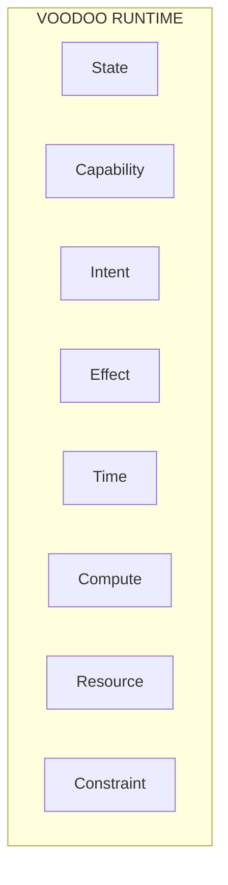

with infrastructure becoming implementations behind those primitives.

---

### 4. The Global Engineering Study

Voodoo's architecture should not be derived exclusively from web frameworks. We study organizations, industries, countries, and engineering traditions that have repeatedly demonstrated the ability to manage extreme complexity.

**The objective is: Extract principles, not copy implementations.**

The following references form Voodoo's architectural lineage.

---

## Part II — Architectural Lineage

---

### 5. United States — Platform Engineering

The United States has produced many of the dominant software and infrastructure platforms of the modern era.

**Important traditions include:**

- Silicon Valley
- Cloud computing
- Distributed systems
- Operating systems
- Internet infrastructure
- Hyperscale computing
- Developer platforms
- SaaS
- Defense technology
- AI infrastructure

#### What Voodoo Learns

| Principle          | Lesson                                                                                     |
| ------------------ | ------------------------------------------------------------------------------------------ |
| **Platform thinking** | A platform should allow many applications to emerge from a small set of primitives.    |
| **Abstraction**       | Complex infrastructure should become accessible through simple interfaces.              |
| **Ecosystems**        | The platform should allow external systems to participate.                             |
| **Scale**             | Architectures should not assume that local development is the final environment.       |

#### Voodoo Translation

```text
Cloud infrastructure   →  Resource abstraction
Distributed compute    →  Compute abstraction
Platform APIs          →  Capability protocol
```

---

### 6. NASA — Systems Engineering

NASA represents one of the strongest traditions of systems engineering. The important lesson is not "space technology" — it is the discipline required when:

- Failure is expensive
- Systems are distributed
- Systems must operate autonomously
- Communication can be limited
- Components can fail
- State must remain consistent
- Missions can last a long time

#### Principles to Extract

- Explicit system boundaries
- Redundancy
- Fault isolation
- Telemetry
- Deterministic behavior
- Mission state
- Recovery
- Autonomous operation
- Rigorous interfaces
- Verification

#### Voodoo Translation

```text
Mission          →  Intent
Subsystem        →  Capability
Mission state    →  Application state
Telemetry        →  Execution / Observability
Fault recovery   →  Durable execution
Autonomy         →  Adaptive runtime
```

---

### 7. SpaceX — Vertical System Integration

SpaceX provides another important architectural lesson. The interesting principle is:

> Control the interfaces between critical systems.

SpaceX integrates:

- Hardware
- Software
- Telemetry
- Control
- Simulation
- Manufacturing
- Operations
- Autonomy

The lesson for Voodoo is not to vertically integrate everything. It is to make the critical semantic boundaries coherent.

#### Voodoo Translation

```text
UI, API, Data, Compute, Events, AI, Storage, Infrastructure
```

should be able to share:

- Execution
- Telemetry
- Identity
- Capabilities
- State
- Constraints

---

### 8. Anduril — Real-Time Operational Software

Anduril is particularly relevant because it represents software operating in the physical world. The interesting architectural pattern is:

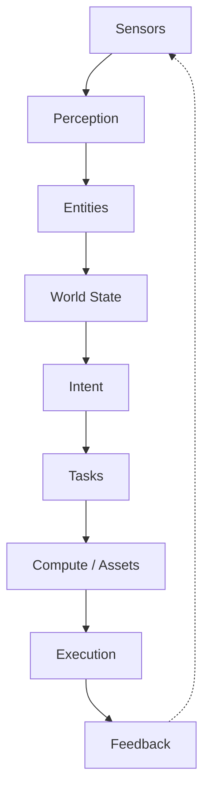

This is much closer to the future Voodoo architecture than a traditional CRUD application.

#### Principle

The system should not merely store information. It should understand:

- What exists?
- What is happening?
- What should happen?
- What capabilities are available?
- What is allowed?
- Who/what can execute?
- What happened after execution?

#### Voodoo Translation

```text
Sensor   →  Resource
Entity   →  State
Intent   →  Intent
Task     →  Execution
Asset    →  Compute
Feedback →  Event
```

---

### 9. Palantir — Ontology

Palantir is important for a different reason. The central idea is the **operational ontology**:

- Objects
- Relationships
- State
- Actions
- Permissions

**The lesson:** Applications should be able to represent the world they operate on, not merely store rows in tables.

A Voodoo application may eventually represent:

- Person
- Machine
- Robot
- Vehicle
- Factory
- Sensor
- Order
- Customer
- Asset
- Location
- Process
- Agent
- Worker

…and relationships between them. This creates a conceptual layer above raw database tables.

---

### 10. Voodoo Ontology

A future Voodoo application may look conceptually like:

```python
class Robot(Entity):
    status: str
    location: Location
    battery: float
    capabilities: list[str]
```

Then:

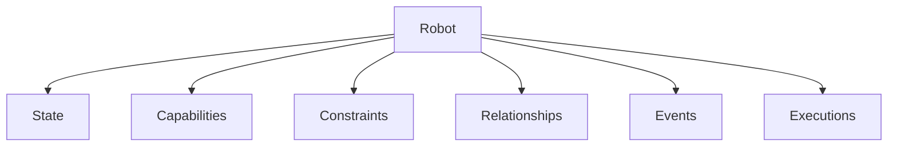

This does not mean Voodoo must copy Palantir's implementation. The principle is:

> Model meaningful entities and their operational relationships.

---

### 11. China — Systems at Scale

China provides important lessons in:

- Infrastructure scale
- Manufacturing
- Logistics
- Integrated technology ecosystems
- Physical + digital systems
- Rapid deployment
- Centralized coordination

The lesson is not political. It is architectural:

> What happens when software is expected to coordinate enormous physical and digital systems?

Voodoo should therefore not assume that applications will always be:

```text
Browser → Server → Database
```

They may become:

```text
Sensors
Robots
Factories
Vehicles
People
Cloud
Edge
AI
Applications
```

---

### 12. Japan — Minimalism and Precision

Japan provides a different lesson. The important concepts include:

- Reduction of waste
- Precision
- Reliability
- Simplicity
- Disciplined processes
- Craftsmanship
- Carefully designed interfaces

**For Voodoo:** The power of the runtime should not require a complicated developer experience. The framework must resist feature accumulation without conceptual discipline.

---

### 13. South Korea — Vertical Technology Ecosystems

South Korea demonstrates how hardware, software, telecommunications, manufacturing, and infrastructure can operate as an integrated technological ecosystem.

**Voodoo can learn:**

- Vertical integration where it matters
- Tight hardware/software feedback loops
- Infrastructure-aware software
- High-performance operational systems

---

### 14. Russia / Soviet Engineering — Constraint Engineering

The relevant lesson is not political. It is **engineering under constraints**.

Systems designed under severe constraints tend to prioritize:

- Robustness
- Redundancy
- Repairability
- Simplicity
- Tolerance for imperfect infrastructure
- Deterministic behavior
- Survivability

Voodoo should support:

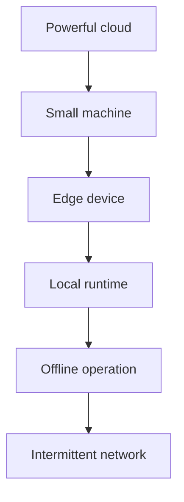

This reinforces the principle: **Local-first semantics, distributed-capable architecture.**

---

### 15. Germany — Systems Engineering

**Important principles:**

- Explicit interfaces
- Industrial automation
- Engineering discipline
- Deterministic processes
- Interoperability
- Long-lived systems

Voodoo should favor **explicit contracts over magic**.

---

### 16. Israel — Operational and Security Systems

**Important principles:**

- Real-time systems
- Security
- Distributed sensing
- Operational awareness
- Rapid adaptation
- Constrained environments

**Voodoo can learn:**

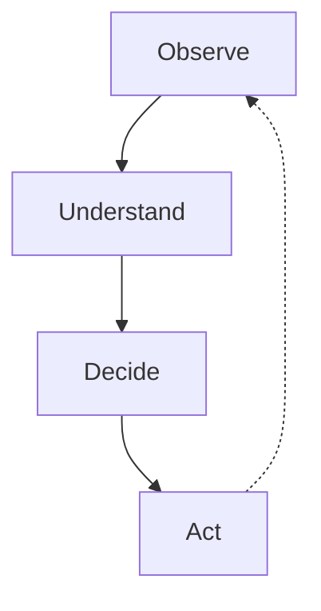

This feedback loop is central to adaptive software.

---

### 17. Singapore — Integrated Infrastructure

Singapore demonstrates the power of designing infrastructure as a coherent system.

**The lesson:** Infrastructure should not feel like dozens of unrelated services.

Voodoo Cloud should eventually expose:

- Runtime
- Database
- Storage
- Queue
- Mesh
- Workers
- Secrets
- Telemetry
- Domains

…as one coherent platform.

---

### 18. Taiwan / TSMC — Specialization Through Abstraction

TSMC demonstrates another powerful principle:

> Extreme internal complexity can coexist with a simple external interface.

The customer does not need to understand the entire manufacturing process. Similarly:

```bash
voodoo deploy
```

…should not require understanding every infrastructure subsystem. But the underlying system must remain technically rigorous.

---

### 19. CERN — Interoperability

CERN demonstrates the importance of:

- Distributed collaboration
- Long-lived infrastructure
- Interoperability
- Scientific data systems
- Heterogeneous computing

Voodoo should therefore avoid assuming one language, one vendor, or one infrastructure provider.

---

### 20. Erlang / OTP — Failure as a First-Class Concept

Erlang/OTP provides one of the strongest conceptual references for Voodoo.

**Important principles:**

- Supervision
- Isolation
- Processes
- Message passing
- Failure recovery
- Fault tolerance

**The lesson:** Failure should be expected rather than treated as an exceptional surprise.

Voodoo should eventually model:

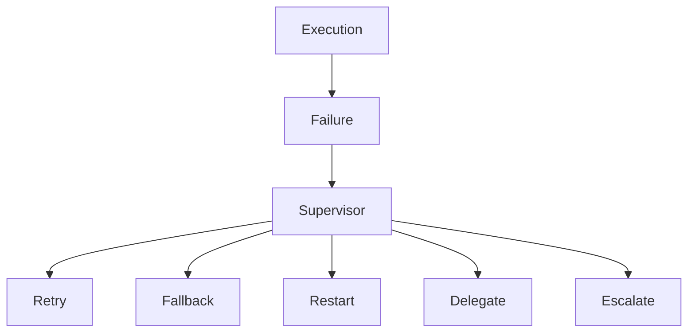

---

### 21. Cloud-Native — Infrastructure as Compute

Cloud-native systems teach:

- Elastic compute
- Immutable deployment
- Declarative infrastructure
- Service boundaries
- Externalized state
- Observability

Voodoo should abstract these concepts rather than force developers to assemble them manually.

---

## Part III — Physical AI & World Model

---

### 22. Physical AI

The next major expansion of the Voodoo vision is **Physical AI**.

AI will increasingly interact with:

- Physical environments
- Robots
- Sensors
- Cameras
- Vehicles
- Machines
- Factories
- Humanoids
- Drones
- Warehouses
- Medical devices
- Industrial equipment

Traditional web application architecture is insufficient for this world. A physical AI system requires:

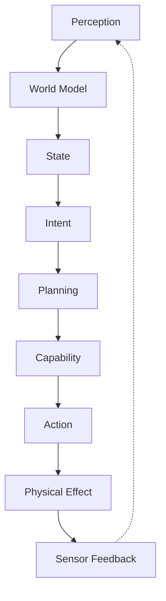

This maps naturally onto Voodoo.

---

### 23. Humanoids

Humanoid robots create an extreme example of the architecture.

A humanoid may contain:

- Cameras
- Lidar
- IMU
- Motors
- Actuators
- Battery
- Local compute
- AI models
- Navigation
- Manipulation
- Memory
- Planning
- Safety systems
- Remote supervision

The software architecture must coordinate all of them.

**Voodoo's long-term primitives could map to:**

- Robot state
- Capability
- Intent
- Constraint
- Task
- Execution
- Effect
- Telemetry
- Event
- Human approval

#### Example

| Stage         | Detail                                      |
| ------------- | ------------------------------------------- |
| **Intent**    | "Move this box to shelf B."                |
| **Planner**   | Determine required capabilities.            |
| **Capabilities** | `navigate`, `detect object`, `grasp`, `move`, `release` |
| **Constraints**  | `battery > threshold`, `human safety zone clear`, `object weight < limit` |
| **Compute**       | Local robot controller, edge model, cloud planner, human fallback |
| **Execution**     | Task graph                                  |
| **Effect**        | Box moved.                                  |
| **Event**          | `box.moved`                                 |
| **State**          | `Robot.location` updated                   |

This is exactly the type of system Voodoo should eventually be capable of representing.

---

### 24. Industrial AI

Voodoo should be capable of supporting:

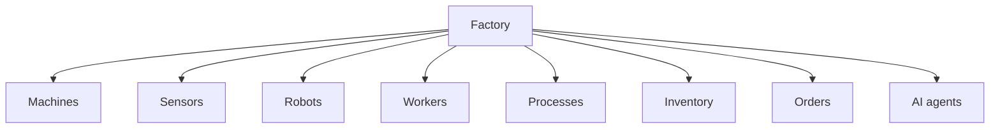

The runtime becomes an operational system.

#### Example

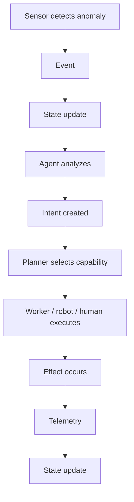

---

### 25. Digital Twins

Digital twins become a natural extension of Voodoo's ontology.

A digital twin is:


**Examples:**

- Robot ↔ Robot Entity
- Machine ↔ Machine Entity
- Vehicle ↔ Vehicle Entity
- Factory ↔ Factory Entity
- Building ↔ Building Entity

Voodoo should eventually allow physical systems to participate in the same execution model as digital applications.

---

### 26. The Unified World Model

The long-term architecture becomes:

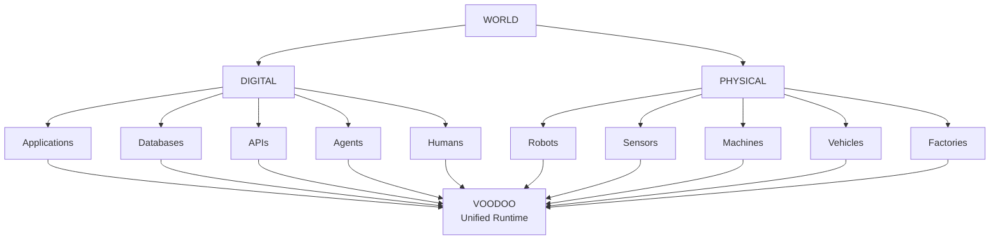

---

## Part IV — Universal Primitives

---

### 27. The Voodoo Universal Primitives

The concepts are not eight equal primitives. They live at different semantic
levels (see [`docs/primitives.md`](docs/primitives.md)).

**Core Ontology** — what the system can represent and pursue:

| Concept        | Description                              |
| -------------- | ---------------------------------------- |
| **Entity**     | Something with identity that participates in the system |
| **State**      | Current operational truth of an entity or system |
| **Intent**     | The desired outcome to achieve            |
| **Capability** | Ability + authorization to produce an effect under conditions |
| **Effect**     | A change produced by an execution         |

**Runtime** — how work happens:

| Concept       | Description                              |
| ------------- | ---------------------------------------- |
| **Execution** | The central runtime mechanism — every operation is one |

**Execution Dimensions** — the conditions under which work happens:

| Concept        | Description                              |
| -------------- | ---------------------------------------- |
| **Compute**    | How the execution is performed (AI is one class) |
| **Time**       | Lifecycle and validity (deadline, timeout, schedule, retry) |
| **Resource**   | What is consumed (CPU, GPU, memory, tokens, energy) |
| **Constraint** | Conditions that must hold                |

**Cross-Cutting Concepts** — across every level:

```text
Event   Identity   Telemetry   Relationship
```

The conceptual model:

```text
Entity → State → Intent → Capability → Execution → Effect → State
```

---

### 28. State

**State represents what the system currently knows.**

**Examples:**

- Database state
- UI state
- Robot state
- Workflow state
- Agent memory
- World state
- Device state

---

### 29. Capability

A **capability** represents something the system is allowed and able to do.

**Examples:**

- `create_user`
- `send_email`
- `query_database`
- `write_storage`
- `move_robot`
- `generate_image`
- `call_model`
- `ask_human`

> Capabilities must be explicit.

---

### 30. Intent

**Intent** represents what someone or something wants to achieve.

**Examples:**

- Create a lead.
- Move this object.
- Generate a report.
- Repair the machine.
- Notify the operator.

> Intent should not necessarily prescribe implementation.

---

### 31. Effect

An **effect** represents an actual mutation of the world.

**Examples:**

- Database write
- Object upload
- Email delivery
- Robot movement
- Machine command
- External API request

> Effects should be observable and, where possible, idempotent.

---

### 32. Time

**Time is a primitive.** It enables:

- Delay
- Schedule
- Timeout
- Deadline
- Retry
- Expiration
- Lease
- Timer
- Temporal workflow

---

### 33. Compute

**Compute** represents anything capable of performing work.

- HTTP request
- Worker
- Agent
- Model
- Robot
- Device
- Process
- Remote service
- Human

> This leads to an important idea: **Humans, AI agents, robots, and traditional software can all be compute participants.**

---

### 34. Resource

**Resources** represent things consumed or referenced.

**Examples:**

- Database
- File
- Object
- Model
- Queue
- API
- Robot
- Machine
- GPU
- Cloud resource

---

### 35. Constraint

**Constraints** limit what an execution can do.

**Examples:**

- Authorization
- Budget
- Timeout
- Rate limit
- Safety rule
- Role
- Location
- Battery level
- Data policy
- Human approval

---

## Part V — Core Execution Model

---

### 36. The Core Voodoo Execution Model

The conceptual center of Voodoo is **Execution**. The full model:

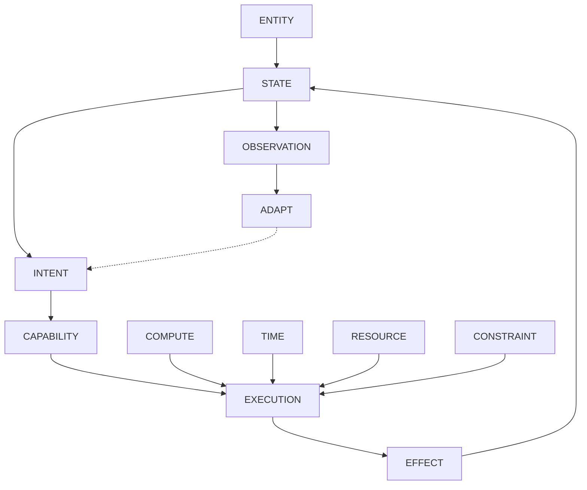

An **Entity** with **State** pursues an **Intent**, which resolves to a
**Capability**, which is performed as an **Execution**. The execution is
governed by **Compute**, **Time**, **Resource**, and **Constraint**. It
produces an **Effect**, which changes **State** — and the feedback loop
adapts future intents.

---

### 37. Execution as the Universal Unit

Every meaningful operation should eventually become an **Execution**.

**Examples:**

- HTTP request
- Agent run
- Tool call
- MCP invocation
- Worker task
- Scheduled task
- Workflow step
- Event handler
- Human approval
- Robot action
- External callback

#### Conceptual Model

```python
Execution(
    id=...,
    parent_execution=...,
    entity=...,
    intent=...,
    capabilities=[...],
    compute=...,
    constraints=[...],
    resources=[...],
    time=...,
    effects=[...],
    events=[...],
    state=...,
    telemetry=...,
    checkpoint=...,
    status=...,
    outcome=...,
    error=...,
    recovery=...,
)
```

Not every field is materialized today — the semantics come first. See
[`docs/execution-model.md`](docs/execution-model.md).

This enables:

- Tracing
- Auditing
- Billing
- Debugging
- Recovery
- Retries
- Supervision
- Distributed execution

---

### 38. Voodoo Mesh

Mesh should evolve from an event helper into a **formal event protocol**.

**Local:**

```python
@mesh.on("lead.created")
async def handler(payload): ...
```

**Remote implementations may use:**

- Redis
- NATS
- Kafka
- RabbitMQ
- Cloud Pub/Sub
- WebSockets
- HTTP

> The application should depend on Voodoo semantics rather than broker-specific APIs.

---

### 39. Events

An event says: **Something happened.**

**Examples:**

- `lead.created`
- `payment.completed`
- `robot.moved`
- `machine.failed`
- `image.processed`

Event envelopes should eventually contain:

| Field             | Description                        |
| ----------------- | ---------------------------------- |
| `id`              | Unique event identifier            |
| `type`            | Event type                         |
| `source`          | Event source                       |
| `timestamp`       | When the event occurred            |
| `schema`          | Schema version                     |
| `correlation_id`  | Correlation identifier             |
| `causation_id`    | Causation identifier               |
| `payload`         | Event payload                      |

---

### 40. Commands

A command says: **Please make something happen.**

**Examples:**

- `create.lead`
- `process.image`
- `move.robot`
- `generate.report`

> Commands are distinct from events.

---

### 41. Tasks

A **task** is executable work.

```python
@task
async def process_image(...):
    ...
```

Tasks may run:

- Locally
- In worker
- Remotely
- On edge
- On robot
- Through agent

---

### 42. Queues

Queues provide delivery and scheduling semantics.

**Voodoo should support:**

- Local queues
- Retries
- Leases
- Visibility timeouts
- Dead-letter queues
- Idempotency
- Backpressure
- Prioritization

---

### 43. Storage

Object storage must be part of the architecture from the beginning.

**The abstraction should support:**

- Local filesystem
- S3
- Cloudflare R2
- MinIO
- GCS
- Azure Blob

#### Example

```python
storage.put("images/example.jpg", data)
storage.get("images/example.jpg")
storage.delete("images/example.jpg")
storage.url("images/example.jpg")
```

> Application code should not depend on S3-specific semantics.

---

### 44. Data

The relational data model should remain simple.

**Current direction:**

- Async ORM
- SQLite
- PostgreSQL adapters
- Transactions
- Migrations
- Policies
- Lifecycle hooks

> SQLite should be excellent for local development. Production deployments should be able to move to external databases.

---

### 45. Reactive UI

Voodoo should remain capable of creating modern interfaces without requiring a separate frontend runtime.

#### Example

```python
@page("/")
def dashboard():
    return Container(Heading("Dashboard"), Card(Text("Hello"), Button("Continue")))
```

**The UI should support:**

- Components
- Reactive state
- Events
- WebSocket updates
- Partial updates
- Forms
- Routing
- Accessibility

---

### 46. Design System

**Current direction:**

- VoodooCSS
- `--vd-*` tokens
- Stack
- Box
- Link
- StyleAdapter

> The objective is semantic design primitives. Voodoo should not become locked to one CSS implementation.

---

### 47. Agents

Agents are **compute participants**. They should not be treated as magical autonomous entities.

**Conceptually:**

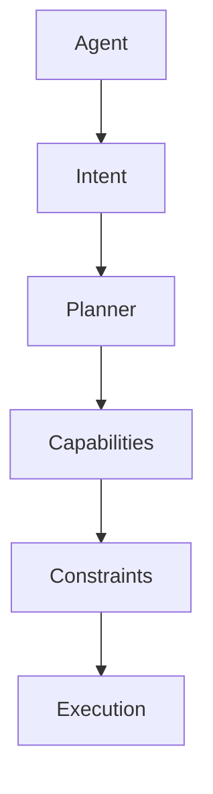

> Agents should use the same execution model as other application operations.

---

### 48. Tools

A **tool** is a capability exposed to one or more execution surfaces.

```python
@tool
async def create_lead(name: str, email: str): ...
```

The same capability can be consumed by:

- Python
- Agent
- MCP
- Mesh
- Workflow
- CLI
- HTTP

> This is a critical Voodoo principle: **One capability, many consumers.**

---

### 49. MCP

MCP should be treated as an **interoperability adapter**.

#### Architecture

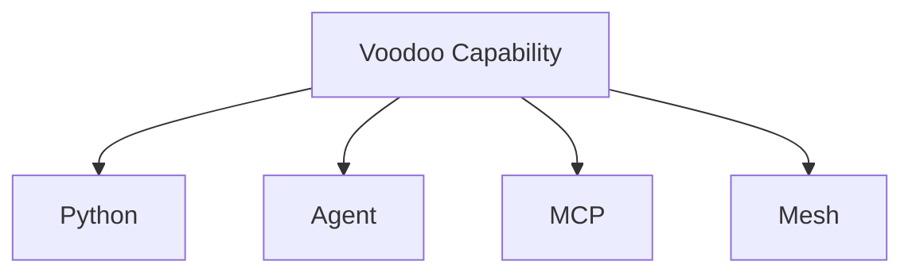

> MCP must not become Voodoo's internal architecture.

---

### 50. Human-in-the-Loop

Humans should be **legitimate compute participants**.

```python
await ask_human(...)
```

Then:

```python
approve(...)
deny(...)
```

A workflow may become:

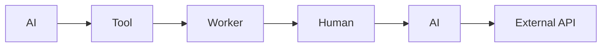

**Humans should have:**

- Identity
- Permissions
- Execution records
- Audit
- Durable state

---

### 51. Planner

The **Planner** resolves intent into executable work.

#### Example

| Stage           | Detail                              |
| --------------- | ----------------------------------- |
| **Intent**      | Generate monthly report.            |
| **Capabilities**| `report.generate`                   |
| **Compute**     | Local worker, remote worker, agent, human, external service |

**Planner decisions may consider:**

- Capability
- Constraint
- Availability
- Cost
- Latency
- Reliability
- Permissions

---

### 52. Adaptive Runtime

The **Supervisor** should manage execution.

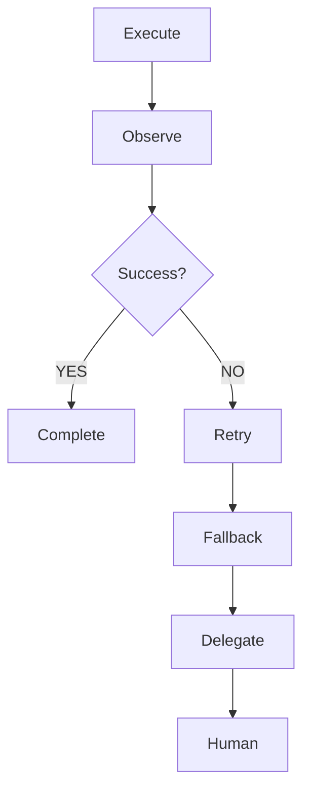

> This is one of Voodoo's strongest long-term differentiators.

---

### 53. Durable Execution

Applications should eventually survive:

- Process crashes
- Deploys
- Machine failures
- Network failures
- Model failures
- Service failures

**The runtime should support:**

- Checkpoint
- Persist
- Resume
- Recover
- Retry

---

### 54. Observability

Every execution should be traceable.

**Minimum information:**

| Field                   | Description                        |
| ----------------------- | ---------------------------------- |
| `execution_id`          | Unique execution identifier        |
| `parent_execution_id`  | Parent execution (for tracing)     |
| `correlation_id`        | Correlation identifier             |
| `causation_id`          | Causation identifier               |
| `actor`                 | Who/what initiated the execution  |
| `capability`            | Capability invoked                 |
| `intent`                | Intent behind the execution       |
| `status`                | Execution status                   |
| `duration`              | Execution duration                 |
| `error`                 | Error details (if any)             |
| `retry_count`           | Number of retries                  |
| `cost`                  | Execution cost                     |
| `tokens`                | Token usage (for AI)               |
| `resource`              | Resources consumed                 |

> The developer should be able to answer: **Why did the system do this?**

---

### 55. Security

Security should be **capability-oriented**.

**Current capabilities include:**

- JWT
- API keys
- Sessions
- RBAC
- Route guards
- CSRF
- CORS
- Rate limiting
- Security headers

**Future architecture:**

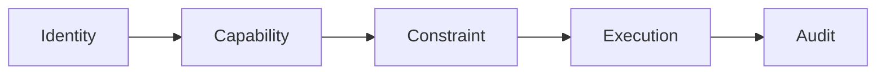

> AI must never receive unrestricted authority.

---

### 56. Protocol

Voodoo should eventually define a **language-neutral protocol**.

**The protocol may expose:**

- Capabilities
- Events
- Executions
- Resources
- Schemas
- Authentication
- Telemetry

**This allows:**

- Python
- TypeScript
- Go
- Rust
- Other systems
- Robots
- Edge devices

…to participate without reproducing the entire runtime.

---

### 57. SDK Strategy

Python remains the primary runtime.

**Potential SDKs:**

- Python
- TypeScript
- Go
- Rust

> SDKs should primarily act as protocol clients where appropriate.

---

### 58. Physical Voodoo

The long-term vision includes physical systems.

A Voodoo application could coordinate:

- Cloud
- Edge
- Robot
- Sensor
- Human
- Agent
- Database
- Storage
- Queue

…using the same semantics.

---

### 59. Robot Execution

#### Example

| Stage           | Detail                                      |
| --------------- | ------------------------------------------- |
| **Intent**      | Move object A to location B.               |
| **Planner**     | Find capabilities.                          |
| **Capabilities**| `detect`, `navigate`, `grasp`, `move`, `release` |
| **Constraints**    | `battery > 20%`, `safety zone clear`, `weight < 10kg` |
| **Compute**     | Robot, edge AI, cloud planner               |
| **Execution**   | `robot.task.123`                            |
| **Effects**     | Motor movement, object relocation           |
| **Events**       | `object.moved`, `robot.position.changed`    |
| **State**        | `robot.location = B`                        |

> This demonstrates why the Voodoo primitives should be designed beyond web applications.

---

### 60. Physical AI Feedback Loop

The complete loop:

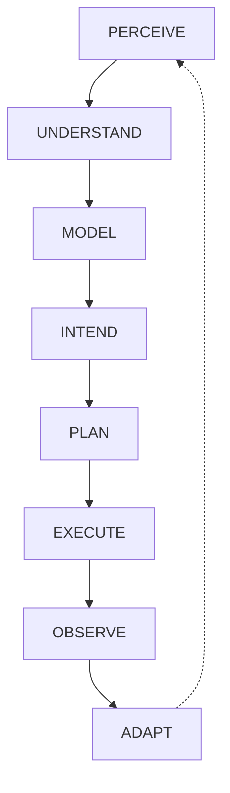

> This should become a fundamental architectural pattern.

---

### 61. Digital + Physical Unification

The future application runtime should not care whether a capability is:

- Python function
- Cloud worker
- AI model
- Human
- Robot
- External API
- Industrial machine

> They are all compute participants. This is the deeper abstraction.

---

### 62. Voodoo Cloud

The eventual cloud experience:

```bash
voodoo deploy
```

**Potential managed services:**

- Application Runtime
- Database
- Object Storage
- Queue
- Mesh
- Workers
- Secrets
- Telemetry
- Domains

> The goal is not to replace every cloud provider. The goal is: **Make correct architecture the easiest architecture.**

---

### 63. Local-First / Cloud-Capable

Voodoo should work locally with minimal infrastructure.

**Example — Local:**

- SQLite
- Local storage
- Local queue
- Local Mesh
- Local worker

**Then production:**

- PostgreSQL
- S3 / R2
- Remote queue
- Remote Mesh
- Distributed workers

> …without changing application semantics.

---

### 64. The Adapter Principle

Infrastructure must sit behind adapters.

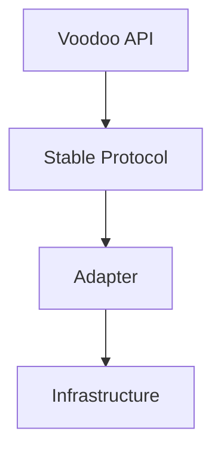

**Examples:**

| Domain    | Adapters                          |
| --------- | --------------------------------- |
| Storage   | S3 / R2 / MinIO                   |
| Database  | SQLite / PostgreSQL               |
| Queue     | Local / Redis / NATS / Cloud      |
| Model     | OpenAI / Anthropic / Gemini / Ollama |
| Compute   | Local / Cloud / Edge              |

---

## Part VI — Boundaries

---

### 65. What Voodoo Must Not Become

| Anti-pattern              | Reason                                      |
| ------------------------- | ------------------------------------------- |
| **A React clone**         | UI is only one dimension.                   |
| **A Python-only prison**  | Python is the primary language, not the protocol boundary. |
| **A Kubernetes wrapper**  | Infrastructure should be simplified, not exposed. |
| **An AI-only framework**  | AI is one form of compute, not a primitive. |
| **An MCP framework**      | MCP is interoperability.                    |
| **A giant standard library** | Only stable primitives belong in the core. |
| **A magic framework**     | Important system behavior must remain observable. |
| **A cloud lock-in platform** | Cloud is optional.                      |

---

## Part VII — Synthesis & Current Position

---

### 66. The Synthesis

The architectural lineage can be summarized:

```mermaid
flowchart TD
    USA["USA — Platform thinking"]
    NASA["NASA — Systems engineering"]
    SpaceX["SpaceX — Vertical integration"]
    Palantir["Palantir — Ontology"]
    Anduril["Anduril — Intent → Task → Execution"]
    Erlang["Erlang — Supervision"]
    Japan["Japan — Minimalism"]
    Russia["Russia — Constraint engineering"]
    China["China — Systems at scale"]
    Korea["Korea — Technology ecosystems"]
    Germany["Germany — Engineering rigor"]
    Israel["Israel — Operational systems"]
    CERN["CERN — Interoperability"]
    Cloud["Cloud — Elastic compute"]
    AI["AI — Reasoning"]
    Robotics["Robotics — Physical action"]

    USA --> VOODOO
    NASA --> VOODOO
    SpaceX --> VOODOO
    Palantir --> VOODOO
    Anduril --> VOODOO
    Erlang --> VOODOO
    Japan --> VOODOO
    Russia --> VOODOO
    China --> VOODOO
    Korea --> VOODOO
    Germany --> VOODOO
    Israel --> VOODOO
    CERN --> VOODOO
    Cloud --> VOODOO
    AI --> VOODOO
    Robotics --> VOODOO

    VOODOO["**VOODOO**"]
```

> The goal is not to replicate these systems. The goal is to synthesize their enduring architectural principles.

---

### 67. Current Repository Position

**Repository:** `helderperez-dev/voodoo`

**Current positioning:** A programmable runtime for adaptive applications and
operational systems.

**Current architecture includes concepts such as:**

- Reactive UI
- Agents
- Tools
- MCP
- Voodoo Mesh
- Workers
- Data
- Authentication
- Telemetry
- Execution engine
- Human-in-the-loop
- Durable recovery
- Planner
- Adaptive runtime

**Conceptual model:**

- Core ontology: Entity, State, Intent, Capability, Effect
- Runtime: Execution
- Execution dimensions: Compute, Time, Resource, Constraint
- Cross-cutting: Event, Identity, Telemetry, Relationship

> The repository is the implementation source of truth. This document is the architectural source of truth.

**Implementation gaps (documented here, not fixed in this task):**

- `Entity` is an ontological concept with no dedicated `Entity` type in code
  yet — it is represented today through `State` (`id` + `kind`) and Identity.
- `pyproject.toml` description, `src/voodoo/__init__.py` docstring, and the
  release workflow description still read "AI-native application framework" /
  "Python Web Framework". These are code/metadata and are recorded as gaps,
  not changed in this documentation task.

**AI development workflow:** The repository includes a structured AI development workflow under `.github/`:

| Directory | Purpose |
|---|---|
| `.github/copilot-instructions.md` | Entry point for GitHub Copilot and AI agents |
| `.github/instructions/` | Domain-specific instruction files (architecture, runtime, providers, execution, ai, testing, **pull-request**) |
| `.github/skills/` | Structured workflows (architecture-review, implement-sprint, add-provider, runtime-feature, testing, documentation, release) |
| `.github/prompts/` | Structured prompts (audit-repository, plan-sprint, architecture-review) |
| `AGENTS.md` | Root-level AI agent instructions (Claude Code, Cursor, etc.) |
| `ARCHITECTURE.md` | Root-level architecture reference |

See [`AGENTS.md`](AGENTS.md) for the full guide.

---

## Part VIII — Master Sprint Roadmap

---

### 68. Master Sprint Roadmap

The roadmap is divided into phases.

> **Implementation tracking:** concrete, releasable work is tracked in
> [`SPRINT_PLAN.md`](SPRINT_PLAN.md) (Sprints 1–21 → releases v1.3.0 → v2.3.0).
> The `S0`–`S22` headings below are the high-level phase view; the sprint
> tracker is the single source of truth for current status.

---

#### Phase 0 — Baseline

##### S0 — Baseline Audit & Benchmarks

| Field     | Value |
| --------- | ----- |
| **Status** | ✅ DONE |

**Objectives:**

- Repository audit
- Architecture map
- Performance baseline
- Startup benchmark
- Rendering benchmark
- Technical debt identification

---

#### Phase 1 — Core Framework

##### S1 — Core Runtime

| Field     | Value |
| --------- | ----- |
| **Status** | ✅ DONE |

**Scope:**

- App
- `@page`
- Routing
- Errors
- Configuration
- Lifecycle
- Runtime foundation

---

##### S2 — UI Component System

| Field     | Value |
| --------- | ----- |
| **Status** | ✅ DONE |

**Scope:**

- Component model
- StyleAdapter
- Component library
- Theme system
- Composition

---

##### DS — Voodoo Design System

| Field     | Value |
| --------- | ----- |
| **Status** | ✅ DONE |

**Scope:**

- VoodooCSS
- `--vd-*` tokens
- Stack
- Box
- Link
- Semantic tokens

---

#### Phase 2 — Reactivity

##### S3 — Reactive State & Events

| Field     | Value     |
| --------- | --------- |
| **Status** | ✅ DONE |

**Scope:**

- State
- Events
- WebSocket updates
- Server/client interaction
- Partial DOM updates

**Target:**

```mermaid
flowchart LR
    State --> Event
    Event --> Effect
    Effect --> StateUpdate["State update"]
    StateUpdate --> UIPatch["UI patch"]
```

---

#### Phase 3 — Data & Compute

##### S4 — Data & Workers

| Field     | Value    |
| --------- | -------- |
| **Status** | ✅ DONE |

**Scope:**

- Model
- Query
- Transaction
- Migrations
- Lifecycle hooks
- Workers
- Retries
- Timeout
- Telemetry

> **Important rule:** Workers must use the unified Execution model.

---

#### Phase 4 — Infrastructure Primitives

##### S5 — Storage & Resource

**Introduce:**

- Resource
- Object storage
- Local adapter
- S3
- R2
- Signed URLs
- Streaming
- Metadata

---

##### S6 — Messaging & Queue Protocol

**Introduce:**

- Event
- Command
- Task
- Queue
- Consumer
- Delivery

**Implement:**

- Local queue
- Retries
- Leases
- Dead-letter
- Idempotency
- Backpressure

---

##### S7 — Mesh v2

**Formalize:**

- Event envelopes
- Schemas
- Correlation
- Causation
- Local transport
- Remote transport
- Adapters

---

#### Phase 5 — AI

##### S8 — Tools & Capability Model

**Stabilize:**

- `@tool`

…and:

- Capability
- Intent
- Constraint
- Effect

---

##### S9 — Agent Runtime

**Scope:**

- Provider abstraction
- Tool calling
- Streaming
- Structured outputs
- Fallback
- Cost
- Token accounting
- Tracing

**Providers:**

- OpenAI
- Anthropic
- Gemini
- Ollama
- Future providers

---

##### S10 — MCP

**Scope:**

- MCP server
- Tool exposure
- Schema mapping
- Capability mapping
- Authentication

---

#### Phase 6 — Intelligent Runtime

##### S11 — Unified Execution Engine

**Unify:**

- HTTP
- Agent
- Tool
- MCP
- Worker
- Task
- Workflow
- Human
- Event

---

##### S12 — Planner

**Implement:**

```mermaid
flowchart TD
    Intent --> CapabilityResolution["Capability resolution"]
    CapabilityResolution --> ComputeSelection["Compute participant selection"]
```

---

##### S13 — Adaptive Runtime

**Implement:**

- Retry
- Fallback
- Delegation
- Escalation
- Budget control
- Constraint-aware execution

---

#### Phase 7 — Durability

##### S14 — Durable Execution

**Scope:**

- Checkpoints
- Durable state
- Recovery
- Timers
- Workflow persistence
- Resume

---

##### S15 — Human-in-the-Loop

**Scope:**

- `ask_human(...)`
- `approve(...)`
- `deny(...)`

> Humans become compute participants.

---

#### Phase 8 — World Model

##### S16 — Entity / Ontology Layer

**Introduce a semantic entity model.**

**Potential concepts:**

- Entity
- Relationship
- State
- Capability
- Action
- Policy

> The objective is to make applications capable of representing operational worlds. This sprint should be carefully designed to avoid becoming an unnecessary ORM duplication.

---

#### Phase 9 — Physical AI

##### S17 — Device / Edge Runtime

**Support:**

- Sensors
- Device state
- Telemetry
- Edge execution
- Intermittent connectivity
- Local inference
- Remote execution

---

##### S18 — Physical Execution

**Introduce abstractions for:**

- Robot
- Machine
- Vehicle
- Device
- Actuator
- Sensor

These should participate in the same:

- Capability
- Intent
- Constraint
- Execution
- Effect
- Event

…model.

---

#### Phase 10 — Protocol

##### S19 — Voodoo Protocol

**Define language-neutral protocol for:**

- Capabilities
- Events
- Executions
- Resources
- Schemas
- Authentication
- Telemetry

---

##### S20 — SDKs

**Initial targets:**

- Python
- TypeScript
- Go
- Rust

---

#### Phase 11 — Cloud

##### S21 — Voodoo Deploy

**Target:**

```bash
voodoo deploy
```

**Provide:**

- Builds
- Deployments
- Environments
- Secrets
- Logs
- Domains
- Health
- Rollback

---

##### S22 — Voodoo Cloud Runtime

**Potential managed primitives:**

- Runtime
- Database
- Storage
- Queue
- Mesh
- Workers
- Telemetry
- Secrets
- Domains

---

## Part IX — Governance & Invariants

---

### 69. Sprint Governance

Every sprint must answer the following questions:

#### Architecture

- What primitive is being introduced?
- What existing primitive does it compose with?
- What protocol does it define?
- What adapter boundary does it create?

#### Runtime

- How does it execute?
- How does it fail?
- How is it observed?
- Can it recover?

#### Security

- What capability does it expose?
- What constraints apply?
- Who is authorized?

#### Developer Experience

- Is the simplest case still simple?
- Does the abstraction reduce cognitive load?

#### Infrastructure

- Does it work locally?
- Can it move to production?
- Can infrastructure be replaced?

#### AI

- Can an agent consume it?
- Is authority bounded?

#### Physical AI

*Where relevant:*

- Can the abstraction operate at the edge?
- Can it survive intermittent connectivity?
- Can physical effects be represented?
- Is safety modeled as a constraint?

---

### 70. Architectural Invariants

These principles should remain stable.

1. No subsystem should invent its own execution model.
2. Capabilities must be explicit.
3. Infrastructure must be accessed through adapters.
4. Events must have defined semantics.
5. Side effects must be observable.
6. Retries must be safe or explicitly non-idempotent.
7. AI must operate through bounded capabilities.
8. Human actions must be first-class executions.
9. Local development must remain simple.
10. Cloud infrastructure must remain optional.
11. Protocols are preferred over vendor-specific APIs.
12. The developer surface should remain small.
13. No primitive should exist without a recurring architectural justification.
14. Avoid premature distribution.
15. Every abstraction requires an escape hatch.
16. Failure must be expected.
17. State must be explicit.
18. Effects must be traceable.
19. Constraints must be enforceable.
20. Physical actions must be represented as effects.
21. The runtime must remain observable.
22. Semantics must survive infrastructure changes.

---

## Part X — Application Model & Thesis

---

### 71. The Voodoo Application Model

The long-term application model:

```mermaid
flowchart TD
    APPLICATION --> DIGITAL
    APPLICATION --> PHYSICAL

    DIGITAL --> DigitalUI["UI / API / DB"]
    DIGITAL --> DigitalAgents["Agents / Workers"]

    PHYSICAL --> PhysicalSensors["Sensors / Robots"]
    PHYSICAL --> PhysicalMachines["Machines / Devices"]

    DigitalUI --> STATE
    DigitalAgents --> STATE
    PhysicalSensors --> STATE
    PhysicalMachines --> STATE

    STATE --> INTENT
    INTENT --> CAPABILITIES
    CAPABILITIES --> CONSTRAINTS
    CONSTRAINTS --> PLANNER
    PLANNER --> COMPUTE
    COMPUTE --> EXECUTION
    EXECUTION --> EFFECT
    EFFECT --> EVENT
    EVENT --> OBSERVE
    OBSERVE --> ADAPT
    ADAPT -.-> STATE
```

> This is the fundamental Voodoo loop.

---

### 72. The Deeper Thesis

The most important insight behind Voodoo is:

> The future application is not merely a collection of functions.

It is a system of:

- Entities
- State
- Capabilities
- Intent
- Constraints
- Compute
- Execution
- Effects
- Events
- Feedback

This applies equally to:

- SaaS
- AI applications
- Factories
- Robots
- Humanoids
- Autonomous vehicles
- Smart buildings
- Logistics
- Healthcare
- Defense
- Research
- Industrial systems

> The UI is simply one interface to the system.

---

### 73. Voodoo's Potential Differentiator

The strongest possible differentiation is not:

> Python is easier.

It is:

> Voodoo provides a unified runtime model for digital and increasingly physical applications.

A developer should be able to express:

- What exists.
- What can happen.
- What should happen.
- What is allowed.
- Who/what can execute it.
- What happened.
- What changed.
- What should happen next.

…through one coherent system.

---

### 74. The Final Mental Model

Voodoo can ultimately be understood as:

```mermaid
flowchart TD
    WORLD --> ENTITIES
    ENTITIES --> STATE
    STATE --> INTENT
    INTENT --> CAPABILITIES
    CAPABILITIES --> CONSTRAINTS
    CONSTRAINTS --> PLANNER

    PLANNER --> AGENT
    PLANNER --> WORKER
    PLANNER --> HUMAN

    AGENT --> EXECUTION
    WORKER --> EXECUTION
    HUMAN --> EXECUTION

    EXECUTION --> EFFECT
    EXECUTION --> EVENT
    EXECUTION --> TELEMETRY

    EFFECT --> STATE2["STATE"]
    EVENT --> STATE2
    TELEMETRY --> STATE2

    STATE2 --> OBSERVE
    OBSERVE --> ADAPT
    ADAPT -.-> INTENT
```

> This is not merely a web framework architecture. It is a general model for adaptive computation.

---

### 75. Final Product Definition

Voodoo should ultimately allow a developer to build a system where:

- UI
- API
- Database
- Storage
- Queue
- Messaging
- Events
- Workers
- Agents
- Tools
- MCP
- Humans
- Robots
- Sensors
- Physical devices
- Cloud infrastructure

…do not feel like independent products. They become expressions of a common runtime.

---

### 76. The One-Sentence Definition

> Voodoo is a programmable runtime for adaptive applications and operational systems — a small, explicit runtime that represents software, AI, distributed systems, human workflows, and physical systems as entities with state, pursuing intents through capabilities and executions that produce observable effects.

---

### 77. Immediate Execution Priority

The immediate priority is not to implement everything. The priority is to **protect the architecture**.

> **Current status** lives in [`SPRINT_PLAN.md`](SPRINT_PLAN.md) — Sprints 1–14
> are shipped (v1.3.0 → v1.16.0); the next sprint is Sprint 15 (Memory
> capability). The table below records the original phase ordering.

| Priority | Sprint                          |
| -------- | ------------------------------- |
| **Now**  | S3 — Reactive State & Events    |
| **Next** | S4 — Data & Workers             |
| **Then** | S5 — Storage / Resource         |
|          | S6 — Messaging / Queues         |
|          | S7 — Mesh                       |
| **Then** | S8 — Capabilities               |
|          | S9 — Agents                     |
|          | S10 — MCP                       |
| **Then** | S11 — Execution                 |
|          | S12 — Planner                   |
|          | S13 — Adaptive Runtime          |
| **Then** | Durability                      |
|          | Human Compute                   |
|          | Ontology                        |
|          | Physical AI                    |
|          | Protocol                        |
|          | SDKs                            |
|          | Cloud                           |

---

### 78. Final Principle

The Voodoo project should always ask:

> Are we adding another feature, or are we discovering a primitive that makes many future features simpler?

The second is the objective.

The ultimate goal is not to make Voodoo the framework with the most features. It is to make Voodoo the framework where the fewest primitives can express the greatest amount of complexity.

**That is the Voodoo thesis.**

---

## END

> **Voodoo — Simplify Extreme Complexity.**
>
> Build the runtime first.
> Build the ecosystem second.
> Let the primitives outlive the implementations.