# Voodoo 1.0 — Implementation Plan

> **The authoritative engineering plan for evolving the existing Voodoo repository into a coherent, production-ready 1.0 release.**
>
> Derived from `SPEC.md` (the completion specification, kept local) and a full audit of the current codebase.
> This document is the single reference that guides all framework development until Voodoo 1.0 ships.

---

## Table of Contents

1. [How to Use This Document](#1-how-to-use-this-document)
2. [Mission & Product Thesis](#2-mission--product-thesis)
3. [The Voodoo Constitution — Non-Negotiable Principles](#3-the-voodoo-constitution--non-negotiable-principles)
4. [Current State Assessment (Baseline Audit)](#4-current-state-assessment-baseline-audit)
5. [Target Architecture](#5-target-architecture)
6. [Public API Contract (Frozen Target)](#6-public-api-contract-frozen-target)
7. [Implementation Phases](#7-implementation-phases)
8. [Roadmap Overview](#8-roadmap-overview)
9. [Cross-Cutting Workstreams](#9-cross-cutting-workstreams)
10. [Security Threat Model](#10-security-threat-model)
11. [Performance Targets](#11-performance-targets)
12. [Architecture Decision Records (Key Decisions)](#12-architecture-decision-records-key-decisions)
13. [Risk Register](#13-risk-register)
14. [Non-Goals — Do NOT Build in 1.0](#14-non-goals--do-not-build-in-10)
15. [Definition of Done — Voodoo 1.0](#15-definition-of-done--voodoo-10)
16. [Future Guardrails — Evolution Engine (2.0)](#16-future-guardrails--evolution-engine-20)
17. [Appendix A — Module Migration Map](#appendix-a--module-migration-map)
18. [Appendix B — The API Decision Test](#appendix-b--the-api-decision-test)

---

## 1. How to Use This Document

| Audience | Usage |
|---|---|
| **Implementation agent (AI)** | Follow phases in order. Every task links to acceptance criteria. Never skip Phase 0. Consult §14 before adding *any* feature. |
| **Maintainer** | Use §7 phases as the backlog. Use §15 as the release gate. Track risks in §13. |
| **Contributor** | Read §3 (constitution), §6 (API contract), §14 (non-goals) before writing code. |

**Working mode:** This is an *evolution* of a working repository, **not a rewrite**. The rule for every task:

```text
understand existing code → preserve working behavior → add tests → refactor toward target API → remove duplication
```

**Priority of authority** (highest first):
1. This plan's phase acceptance criteria
2. `SPEC.md` specification (local, not committed)
3. Existing working code + passing tests
4. Personal preference

---

## 2. Mission & Product Thesis

### 2.1 Positioning

> **Voodoo — The AI-native application framework for Python.**
> Build reactive UIs, APIs, agents, background workers, realtime systems, MCP tools and data-driven applications in one Python runtime.

**Long-term vision:** *Build applications that evolve.* — but Voodoo 1.0 **builds** applications; it does not yet *modify* them.

### 2.2 The Differentiation Thesis

Voodoo is NOT positioned against React, Reflex, or Django. The differentiation stack:

| Differentiator | Meaning |
|---|---|
| **AI-native by design** | Agents, tools, MCP are first-class primitives, not add-ons |
| **Agents as application primitives** | `Agent()` sits next to `Button()` |
| **Voodoo Mesh** | Unified event layer connecting UI ↔ workers ↔ agents ↔ apps |
| **One tool, many consumers** | `@tool` serves Python, Agents, MCP, Mesh simultaneously |
| **Observability everywhere** | Correlation IDs + telemetry as the sensory system |
| **Zero-config runtime** | `voodoo new` → `voodoo dev` → working app. No npm, no bundler, no config |

### 2.3 The One-Sentence Standard

> Every major Voodoo API must pass: **"Can a Python developer understand what this does just by reading it?"**

The acceptance application (must read like plain Python, hiding HTTP/ASGI/HTML/CSS/JS/WebSockets/DB/LLM/MCP/telemetry):

```python
from voodoo import App, page, Agent, Model, Button, Card, Text, tool, mesh

app = App()


class Lead(Model):
    name: str
    company: str


@tool
async def research_company(company: str): ...


agent = Agent(model="openai:gpt-5", tools=[research_company])


@mesh.on("lead.created")
async def analyze_lead(lead):
    await agent.run(f"Research {lead.company}")


@page("/")
async def home():
    return Card(Text("AI Sales Agent"), Button("Start"))


app.run()
```

---

## 3. The Voodoo Constitution — Non-Negotiable Principles

These rules outrank feature requests. When in conflict, the smaller principle wins.

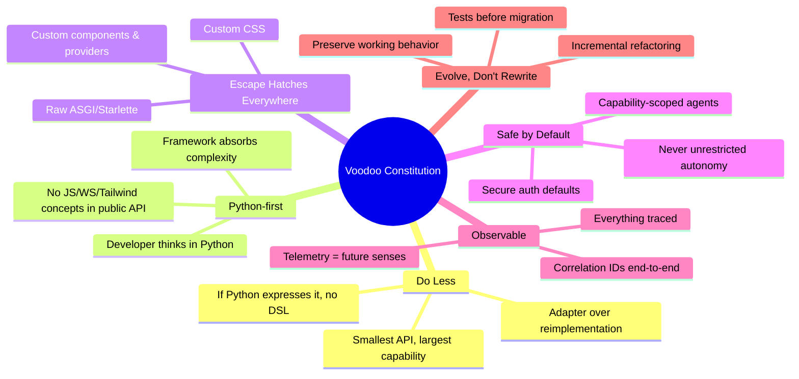

### 3.1 The Decision Test (apply to EVERY change)

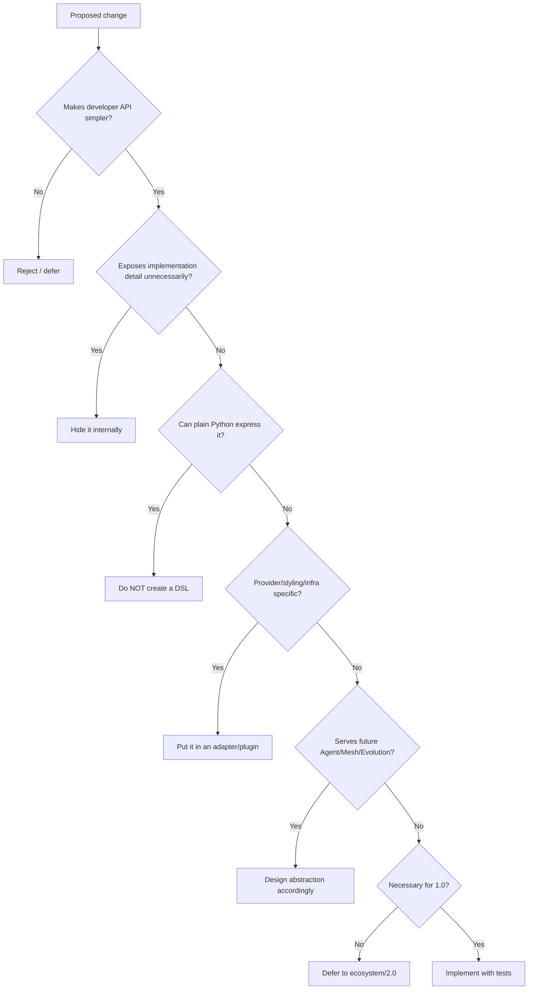

### 3.2 Naming Law

| Kind | Convention | Examples |
|---|---|---|
| Components / classes | `PascalCase` | `App`, `Button`, `Card`, `Agent`, `Model`, `Theme` |
| Functions / decorators | `snake_case` | `page`, `state`, `event`, `tool`, `trace` |
| Runtime namespaces | `snake_case` object | `api.get`, `mesh.emit`, `mesh.on`, `mesh.expose` |
| Events | `dot.notation`, namespaced | `lead.created`, `agent.completed` — never `created`, `done` |
| CLI | `voodoo <command>` | `voodoo new`, `voodoo dev`, `voodoo routes`, `voodoo doctor` |

---

## 4. Current State Assessment (Baseline Audit)

> Audit performed against the working repository at version **1.0.22**. These facts drive the plan.

### 4.1 Inventory

**Codebase: ~7,576 LOC across 20 flat modules + 10 test files.**

| Module | LOC | State vs Target |
|---|---:|---|
| `cli.py` | 1,140 | Exists; oversized, needs `new`/`dev`/`routes`/`doctor` finalization |
| `auth.py` | 836 | Feature-complete; needs hardening + API reduction |
| `components.py` | 778 | Exists; lacks semantic props, style-adapter isolation, `class_`/`aria_*` handling |
| `core.py` | 535 | `create_app()` — must evolve into `App` while keeping compat |
| `security.py` | 328 | Middleware exists; needs security review pass |
| `mcp.py` | 235 | Client exists; needs unified Tool Registry integration |
| `__init__.py` | 232 | **~130 exports — target is ~40. Biggest cleanup target.** |
| `data.py` | 219 | `BaseModel` exists; target `Model` CRUD facade missing |
| `mesh.py` | 212 | Exists; needs `emit`/`on`/`expose` stabilization + event envelope |
| `api.py` | 203 | `api` router namespace exists |
| `telemetry.py` | 178 | `trace` + store exist; needs correlation IDs + AI metrics |
| `config.py` | 158 | Exists; needs env-driven simplification |
| `status.py` | 145 | Service status — keep internal |
| `theme.py` | 122 | Exists; needs semantic token contract |
| `i18n.py` | 116 | Keep, stabilize |
| `storage.py` | 93 | Keep, stabilize |
| `queue.py` | 71 | Exists; needs `@task` facade + retries/timeouts |
| **`agent.py`** | **41** | **Placeholder-grade. No provider abstraction, no streaming, no tools. Largest build item.** |
| `client.js` | — | Browser runtime; keep minimal, hide behind state/event APIs |

**Tests present:** auth, cli, components, data, i18n, queue, security, seo, theme, websocket.
**Tests missing:** agent, mesh, mcp, telemetry, routing/core, **public API contract**, integration, performance.

### 4.2 Gap Analysis

| # | Target (spec) | Current | Gap | Effort |
|---|---|---|---|---|
| G1 | `App()` central abstraction | `create_app()` | Add `App` class wrapping existing factory | S |
| G2 | `@page` decorator | none (pages live in `cli.py` concepts) | New routing primitive | S |
| G3 | `state()` reactive primitive + browser sync | none | **New subsystem** (State, subscribe, WS invalidation) | L |
| G4 | `@event` decorator | `register_event` internal | Public wrapper + stabilization | S |
| G5 | `@tool` unified abstraction | `mcp.tool` only | **New Tool Registry** consumed by Agent+MCP+Mesh | L |
| G6 | `Agent` with providers/streaming/tools/runs | 41-line stub | **New subsystem** (provider interface, run model, telemetry) | XL |
| G7 | `Model` CRUD facade (`Lead.create/get/all/save`) | `BaseModel` + hooks | Public facade over existing layer | M |
| G8 | `@task` worker facade | `enqueue`/`queue` | Decorator + retries/timeouts/telemetry | M |
| G9 | Style adapter boundary (Tailwind isolated) | Tailwind classes embedded in components | Extract `StyleAdapter` contract | M |
| G10 | Custom CSS + `class_` escape hatch | partial | Attribute pipeline (`class_`, `for_`, `aria_*`, `data-*`) | M |
| G11 | `Theme` semantic tokens | `ThemeColors` | Token contract → CSS vars/Tailwind config translation | M |
| G12 | Mesh `emit/on/expose` + event envelope | partial mesh | Envelope (id, ts, source, correlation), namespaces | M |
| G13 | Correlation IDs end-to-end | none in telemetry | ContextVar propagation request→event→agent→tool→db | M |
| G14 | AI telemetry (tokens/cost/runs) | none | Agent run records + token accounting | M |
| G15 | `voodoo new` scaffolding + file-based pages | partial CLI | Convention loader `pages/[id].py` | M |
| G16 | Public API contract tests | none | New test suite pinning `__all__` | S |
| G17 | Packaging extras (`voodoo[ai]`, etc.) | flat deps | Optional dependency groups | S |
| G18 | `__init__` reduction (~130 → ~40 exports) | 130+ | Deprecation cycle | M |
| G19 | Killer AI example app | none | `examples/ai_saas/` | M |
| G20 | Performance benchmarks | none | Benchmark suite + baseline | S |

### 4.3 Pre-Existing Strengths (preserve these)

- Working ASGI runtime, routing, WebSockets, middleware stack
- Mature auth surface (JWT, sessions, API keys, RBAC) with tests
- Security middleware (CSRF, CORS, rate limit, headers) with tests
- SEO/GEO/i18n/theme with tests
- SQLite data layer with hooks
- CLI foundation with tests
- CI (GitHub Actions) + pre-commit + ruff + mypy configured

---

## 5. Target Architecture

### 5.1 System Overview

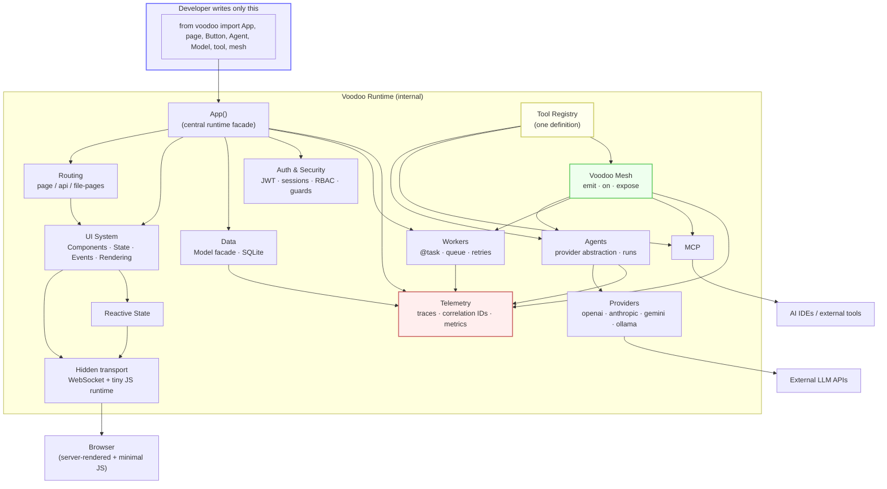

### 5.2 The Mental Model — Five Primitives

Everything the developer learns is one of five primitives. Everything else is infrastructure.

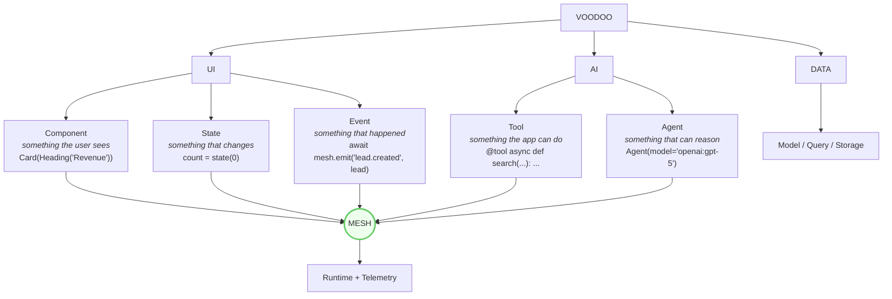

### 5.3 Target Module Layout

> **Incremental migration, not big-bang.** Current flat modules remain importable during migration (see Appendix A). The target end-state organizes boundaries; exact intermediate layout may differ.

```text
voodoo/
├── __init__.py            # ~40 public exports ONLY
├── core/
│   ├── app.py             # App, create_app (compat shim)
│   ├── config.py          # env-driven configuration
│   ├── errors.py          # VoodooError hierarchy
│   └── registry.py        # Route/Tool/Agent/Model/Event registries
├── routing/               # page, api, file-based pages
├── ui/
│   ├── components.py      # Component base + core set
│   ├── state.py           # reactive state
│   ├── events.py          # browser event binding
│   ├── rendering.py       # SSR + hydration markers
│   └── styles/            # StyleAdapter contract
├── adapters/
│   └── tailwind/          # isolated Tailwind adapter (default)
├── data/                  # Model facade, SQLite
├── auth/                  # hardening pass, reduced surface
├── security/              # middleware stack
├── mesh/                  # emit/on/expose, event envelope
├── ai/
│   ├── agent.py           # Agent, AgentRun
│   ├── providers.py       # LLMProvider interface + impls
│   └── tools.py           # @tool, ToolRegistry
├── mcp/                   # consumes ToolRegistry
├── workers/               # @task, queue
├── telemetry/             # trace, correlation, AI metrics
├── seo/ · i18n/ · theme/
├── cli/                   # new · dev · routes · doctor · version
└── static/client.js       # minimal browser runtime
```

### 5.4 Layering Rules (enforced in review)

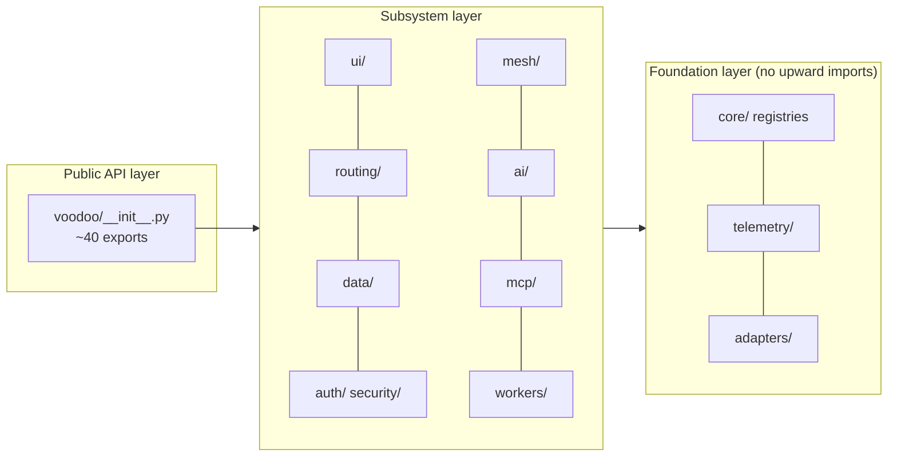

**Rules:**
1. Foundation never imports subsystems.
2. Subsystems talk to each other only through registries or Mesh.
3. `ai/` must not import `mcp/` — both consume `ToolRegistry`.
4. Nothing imports Starlette/Uvicorn/Tailwind types into the public API.

---

## 6. Public API Contract (Frozen Target)

### 6.1 Target Exports (~40)

```python
from voodoo import (
    # Core runtime
    App,
    page,
    api,
    state,
    event,
    trace,
    # AI
    Agent,
    tool,
    # Data
    Model,
    # Events
    mesh,
    # Theming
    Theme,
    # UI — core set
    Page,
    Button,
    Card,
    Text,
    Heading,
    Input,
    Form,
    Modal,
    Table,
    Badge,
    Avatar,
    Nav,
    Header,
    Main,
    Section,
    Article,
    Footer,
)
```

**Rules:**
- Everything else moves to subpackage namespaces (e.g., `voodoo.auth.hash_password`, `voodoo.seo.SEO`) or becomes internal.
- `__all__` is pinned by a **contract test** that fails CI on accidental additions.
- Removal path: deprecate (warning + docs) → move to subpackage → remove only with strong reason.

### 6.2 Canonical API Signatures

```python
# App — one object, sane defaults for every subsystem
app = App(theme=Theme(primary="#6366f1", radius="md", font="Inter"))
app.use(plugin)                    # extension point
app.run()                          # dev server

# Routing — Python decorators, nothing custom
@page("/")
@page("/users/{id}")               # async def user(id: int)
@api.get("/users") · @api.post("/users")

# Reactive state — observable, transport hidden
count = state(0)
count.set(10); count.update(lambda x: x + 1); count.subscribe(fn)

# Events — Python functions
Button("Save", on_click=save_lead)     # @event async def save_lead(data): ...

# Mesh — three verbs
await mesh.emit("lead.created", lead)
@mesh.on("lead.created")
@mesh.expose                          # explicit remote capability

# Tools — one definition, four consumers
@tool(permissions=["leads:read"])
async def search_leads(query: str) -> list[Lead]: ...

# Agent — thin, provider-agnostic
agent = Agent(model="openai:gpt-5", tools=[search_leads])
result = await agent.run("Analyze this lead", context={"lead_id": id})
async for chunk in agent.stream("Analyze this"): ...   # text|tool_started|tool_finished|thinking|error|completed

# Model — CRUD facade (Pydantic + SQLite underneath)
class Lead(Model):
    name: str; company: str; score: float
lead = await Lead.create(name="John", company="Acme", score=0.82)
lead = await Lead.get(id); leads = await Lead.all(); await lead.save()

# Workers
@task(retries=3, timeout=30)
async def process_lead(lead_id): ...

# Styling — semantic by default, CSS escape hatch always
Button("Save", variant="primary", size="lg")           # no Tailwind knowledge
Button("Save", class_="my-button", aria_label="Save")  # full escape hatch
```

### 6.3 Internal Contracts (implementation-facing)

**Component base** — every component shares one rendering spine:

```python
class Component:
    children: list          # flattens: str | num | Component | iterable | None
    props: dict             # semantic props (variant, size)
    attrs: dict             # raw HTML attrs (class_, for_ → class, for; aria_*, data-*)
    def render(self) -> str # escaping enforced, no per-component HTML logic
```

**Style adapter** — the only place Tailwind is mentioned:

```python
class StyleAdapter:
    def component_classes(self, component: str, props: dict, theme: Theme) -> str: ...
```

**Tool** — introspectable metadata powering Agent + MCP + Mesh + CLI + docs:

```python
ToolSpec: name, description, input_schema, output_schema, permissions, source(module:file:line), version
```

**Mesh event envelope:**

```python
Event: name, payload, id, timestamp, source, correlation_id
```

**Provider interface:**

```python
class LLMProvider:
    async def complete(...): ...
    def stream(...) -> AsyncIterator[ProviderEvent]: ...
```

**Error hierarchy:**

```text
VoodooError
 ├── ConfigurationError · RoutingError · ComponentError · StateError
 ├── EventError · MeshError · MCPError
 ├── DataError · AuthError
 └── AgentError · ToolError
```

---

## 7. Implementation Phases

> Phases follow the spec's mandated priority order. Each phase has **entry criteria**, **workstreams**, **exit criteria (acceptance)**. Phases 1–3 partially parallelize; Phase 4 depends on Tool Registry from Phase 2/3 groundwork; Phase 5 depends on all.

### Phase Overview

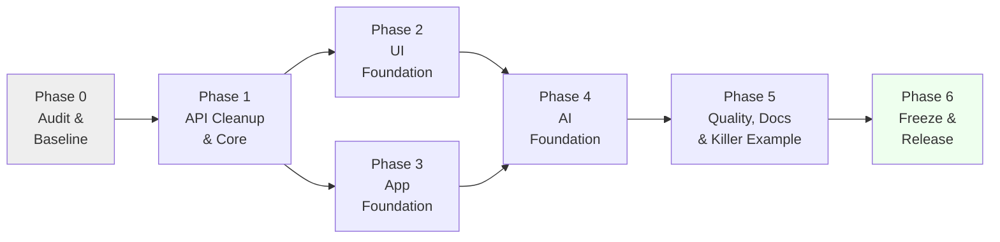

---

### Phase 0 — Repository Audit & Baseline  *(nothing else starts before this)*

**Goal:** Establish ground truth. No architectural changes.

**Tasks**
- [ ] P0.1 Run full test suite; record pass/fail baseline in `docs/BASELINE.md` (internal)
- [ ] P0.2 Build the implementation map (App→Routing→UI→Data→Auth→Workers→Mesh→AI→MCP→Telemetry→CLI) with file/line references
- [ ] P0.3 Tag duplicates, placeholders, dead code, TODOs, untested modules
- [ ] P0.4 Catalog current public API (every name in `__init__.__all__` + usage in tests/examples)
- [ ] P0.5 Set up performance micro-benchmarks skeleton (startup, request latency, render) — **measure before changing**
- [ ] P0.6 Snapshot current behavior of: `create_app`, mesh, queue, components rendering, auth flows (golden tests where cheap)

**Exit criteria**
- Test baseline green (or failures documented with tickets)
- `docs/BASELINE.md` exists with map + gap confirmation of §4.2
- Benchmark baseline numbers committed

---

### Phase 1 — API Cleanup & Core Stabilization

**Goal:** Small intentional public API; `App` and routing feel like the spec.

**Workstreams**

**1.1 `App` abstraction** (gap G1)
- [ ] Introduce `class App` wrapping the existing `create_app` machinery; `App()` produces identical behavior
- [ ] `create_app` remains as a compat alias (deprecation warning scheduled for post-1.0, not removed in 1.0)
- [ ] `app.run()` → uvicorn with the spec's clean startup banner (Local/Docs/Network/Ready)

**1.2 `voodoo.__init__` reduction** (G18)
- [ ] Define target `__all__` (§6.1); move the rest to subpackages: `voodoo.auth`, `voodoo.security`, `voodoo.seo`, `voodoo.i18n`, `voodoo.storage`
- [ ] Keep moved names importable from old locations during 1.0 cycle (re-export + `DeprecationWarning`)
- [ ] Add **contract test**: exact set equality on `voodoo.__all__`; CI fails on accidental export

**1.3 Routing stabilization** (G2)
- [ ] `@page(path)` decorator → registers SSR page route (sync + async handlers)
- [ ] Path params with type conversion (`/users/{id}` → `id: int`)
- [ ] `api` namespace finalized: `api.get/post/put/delete/patch`
- [ ] Verify existing routes/middleware keep working; adapt `cli.py` route listing (`voodoo routes`)

**1.4 Error hierarchy + configuration** (partial G13 prep)
- [ ] `core/errors.py` with `VoodooError` tree; wrap third-party exceptions at boundaries while preserving originals internally
- [ ] Config: env-driven (`VOODOO_ENV`, `VOODOO_DEBUG`, `DATABASE_URL`, provider keys), secure defaults, no YAML requirement

**Exit criteria**
```python
from voodoo import App, page

app = App()


@page("/")
def home():
    return Text("Hello")
```
works; contract test pins `__all__`; all Phase 0 baseline tests still green; startup benchmark not regressed.

---

### Phase 2 — UI Foundation

**Goal:** Components, state, events, styling abstraction — the developer-facing UI spine.

**Workstreams**

**2.1 Component contract** (G10)
- [ ] Single `Component` base: children flattening (str/num/Component/iterable/None-safe), attr pipeline (`class_→class`, `for_→for`, `aria_*→aria-*`, `data_*→data-*`), enforced escaping, one rendering path
- [ ] Port existing components onto the base (behavior-preserving migration per component, tests first)
- [ ] Semantic props: `variant`, `size` on Button/Card/Badge/Input/…
- [ ] Accessibility defaults baked in (labels, roles, aria where standard)

**2.2 Styling adapter boundary** (G9, G11)
- [ ] Extract `StyleAdapter` contract; Tailwind logic moves to `voodoo/adapters/tailwind` — **zero Tailwind strings inside component definitions**
- [ ] `Theme` semantic tokens (`primary`, `background`, `radius`, `font`, …) translated by the renderer into CSS variables / Tailwind config
- [ ] Custom CSS: project `styles.css` auto-loaded by convention; `class_` passes through untouched

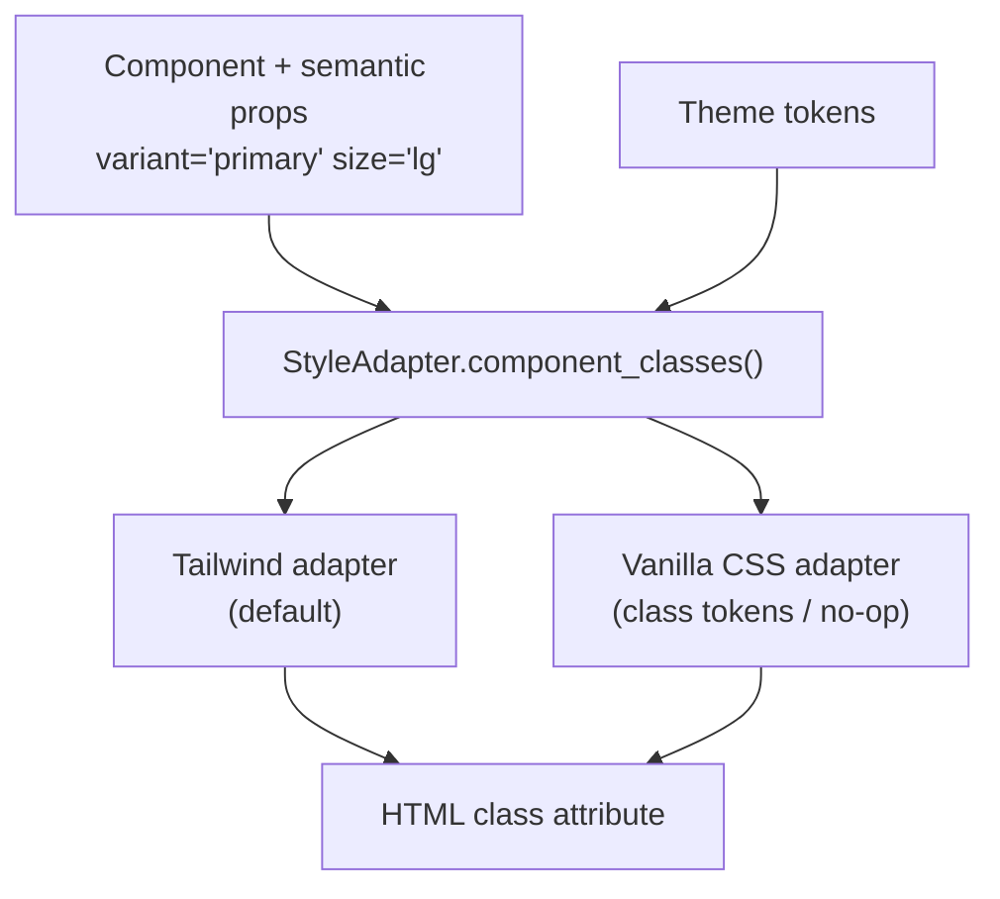

**2.3 Reactive state** (G3)
- [ ] `state(value)` → observable (`get/set/update/subscribe`), ContextVar-scoped to session/page for future scopes
- [ ] Server: subscription registry → on change, compute affected components → push minimal DOM update via existing WS layer
- [ ] Browser runtime (`client.js`): apply updates, dispatch events, reconnect — developer writes zero JS
- [ ] State scopes designed-but-minimal: local/page today; session/app extensible without breaking changes

**2.4 Events** (G4)
- [ ] `@event` decorator; `on_click=<python fn>` binding through the WS transport (hydration markers on SSR output)
- [ ] Confirm: no generated-JS strings in public API; internals only

**Exit criteria**
- Counter app (§6.2 canonical state example) works in browser with live updates, zero JS written
- `Button("Save", variant="primary")` renders with adapter classes; swapping adapter changes classes without app changes
- Golden render tests for core components; existing component tests pass on new base

---

### Phase 3 — Application Foundation

**Goal:** Data, auth hardening, workers, telemetry correlation, CLI/scaffolding.

**Workstreams**

**3.1 Model facade** (G7)
- [ ] `class Lead(Model)` with async `create/get/all/save/delete`; Pydantic + aiosqlite underneath (existing `data.py`)
- [ ] Keep existing hooks (`on_insert`, `on_update`) working; design storage backend boundary so PostgreSQL can be an adapter later
- [ ] Table creation conventions (create-if-absent for 1.0; migrations = extension point only)

**3.2 Auth & security hardening** (no new features)
- [ ] Audit pass over §10 threat model: cookie flags, JWT expiry/validation, CSRF, CORS, rate limiting, secret handling, error leakage, password hashing parameters
- [ ] Reduce auth public surface to subpackage; document the kept essentials
- [ ] Route guards (`login_required`, role/permission decorators) verified against new `page`/`api` routing

**3.3 Workers** (G8)
- [ ] `@task` decorator (retries, timeout, structured errors, telemetry span)
- [ ] Queue integration with Mesh events (`@mesh.on` → `@task` chain natural)
- [ ] Document single-process scope; boundary named for future distributed backend

**3.4 Telemetry & correlation** (G13)
- [ ] `trace` decorator stabilized; spans for: request, db query, worker execution, mesh event, tool call, agent run
- [ ] **Correlation ID propagation**: request → mesh event → worker → agent run → tool call → db (ContextVar carrier)
- [ ] Unified store/API for the future DevTools/doctor to consume

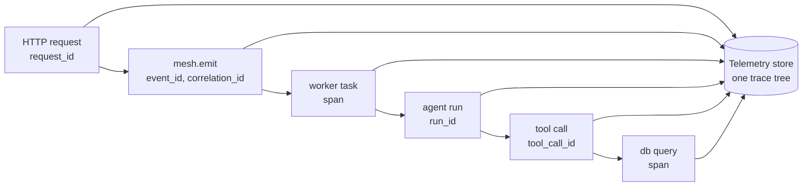

**3.5 CLI & scaffolding** (G15)
- [ ] `voodoo new my_app` → clean minimal project (`app.py`, `pages/`, `components/`, `models.py`, `agents/`, `workers/`, `styles.css`, `tests/`, `pyproject.toml`) — nothing extra
- [ ] File-based pages: `pages/index.py`, `pages/about.py`, `pages/users/[id].py` → `/`, `/about`, `/users/{id}`
- [ ] `voodoo dev` (banner per spec), `voodoo routes`, `voodoo doctor` (runtime/db/auth/mesh/mcp/provider/workers/telemetry checks + warnings), `voodoo version`
- [ ] Trim CLI to the core set; move extras behind existing commands where already implemented

**Exit criteria**
- `voodoo new demo && cd demo && voodoo dev` yields a working app with file-based pages, no manual setup
- A traced request that triggers mesh → worker → db produces one correlated trace tree
- Security test suite green (Phase 5 hardens further)

---

### Phase 4 — AI Foundation  *(the differentiating phase)*

**Goal:** Real agents with real providers; tools as the unified currency; Mesh as the AI event bus.

**Workstreams**

**4.1 Tool Registry** (G5) — build FIRST, Agent and MCP depend on it
- [ ] `@tool` decorator → `ToolSpec` (name, description, schemas from typing, permissions, source metadata, stable string identity — not memory address)
- [ ] `ToolRegistry` single source of truth; consumers: Agent, MCP, CLI, docs, telemetry
- [ ] Permission metadata extension point (`permissions=["leads:read"]`) — recorded, not yet enforced by a policy engine

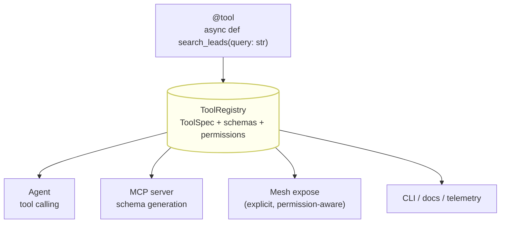

**4.2 Provider abstraction** (G6)
- [ ] `LLMProvider` interface: `complete`, `stream` (normalized events), token/cost accounting
- [ ] Providers: `openai` (existing dep), `anthropic`, `gemini`, `ollama` — **optional extras**, lazy imports, provider not installed → actionable `ConfigurationError`
- [ ] `model="provider:model"` resolution; app code never changes when providers are added

**4.3 Agent** (G6)
- [ ] `Agent(model=..., tools=[...])`; execution loop: prompt → model → tool calls (via registry) → final
- [ ] `run()` returns `AgentRun` record (`run_id`, model, provider, timings, tokens, cost, tool calls, status, error)
- [ ] `stream()` yields normalized events: `text | tool_started | tool_finished | thinking | error | completed` — never provider-native formats
- [ ] Lifecycle states: created → configured → running → (tool_call ⇄ thinking) → completed | error → retry/failed; captured in telemetry
- [ ] Explicit `context={...}` parameter; context ≠ memory ≠ database (keep concepts separate; no memory framework in 1.0)

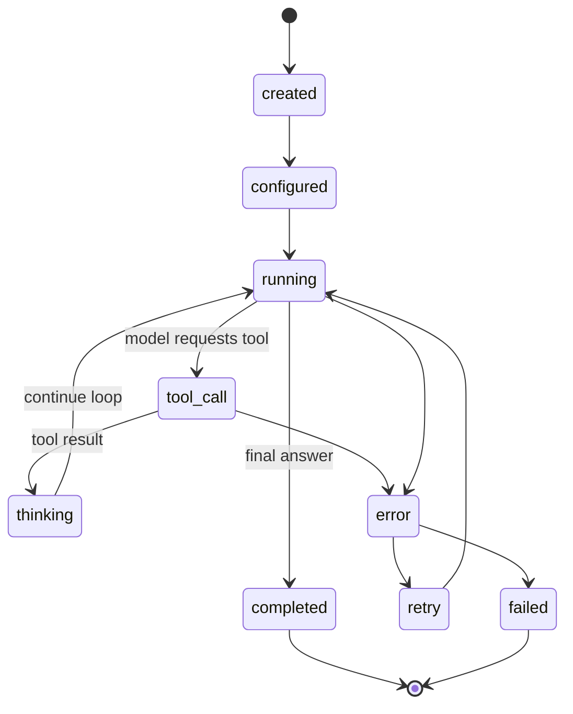

**4.4 Unified AI events over Mesh** (G12 + spec §122)
- [ ] Agent lifecycle publishes namespaced mesh events: `agent.started`, `agent.output`, `agent.tool.started`, `agent.tool.completed`, `agent.failed`, `agent.completed`
- [ ] The UI reacts to agent activity through Mesh — **no special agent/WebSocket plumbing**. This is the flagship pattern; prove it in tests.

**4.5 MCP integration** (G5)
- [ ] MCP layer consumes `ToolRegistry` (no separate `@mcp_tool`); existing `MCPClient`/`mcp` stabilized
- [ ] Tools exposable via MCP with schema generation from `ToolSpec`

**4.6 Mesh stabilization** (G12)
- [ ] Finalize `mesh.emit / mesh.on / mesh.expose`; event envelope (§6.3); namespaced event names enforced by lint helper
- [ ] `expose` = explicit remote capability with permission awareness (local-first; remote transport = future)
- [ ] Local event ≠ remote event: boundary documented for future auth/signing/replay protection

**4.7 AI telemetry** (G14)
- [ ] Per-run records: model, provider, latency, input/output/total tokens, estimated cost, tool calls, errors, retries
- [ ] Agent/tool spans correlated with originating request (Phase 3.4 carrier)

**Exit criteria**
- Spec §2.3 acceptance app runs end-to-end with a real provider (plus a deterministic mock provider for CI)
- Same `@tool` invoked by: python call, agent run, MCP consumer — one definition
- Agent stream events normalized & tested; agent run records queryable from telemetry store
- Token/cost accounting present on every run

---

### Phase 5 — Quality, Documentation & Killer Example

**Goal:** Prove the thesis; make it trustworthy.

**Workstreams**

**5.1 Test pyramid completion**

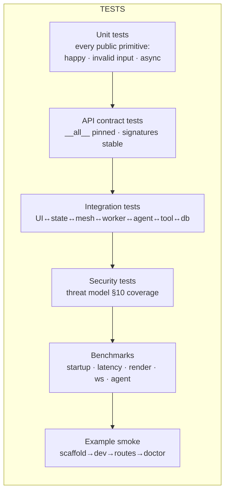

- [ ] Contract suite: public API pinned; compatibility tests for deprecated paths
- [ ] Integration: full reactive loop; mesh→worker→agent→tool→db; auth-guarded routes; MCP tool exposure
- [ ] Security suite per §10; deterministic mock LLM provider (no network in CI)
- [ ] Benchmarks: baseline vs Phase 0 numbers; regression gate in CI (warn-level)

**5.2 Documentation** (built with Voodoo where practical)
- [ ] Docs pages: Installation · Hello World · Components · Routing · State · Events · Data · Auth · Agents · Tools · MCP · Mesh · Workers · Telemetry · Deployment · Architecture
- [ ] Page formula: *What it is → minimal example → common usage → advanced → API reference*
- [ ] README rewritten around the AI-native thesis (structure per spec §92); **market "built for the future of adaptive applications", never "self-evolving today"**

**5.3 Killer example — AI SaaS demo** (G19)
- [ ] `examples/`: `hello_world/`, `dashboard/`, `realtime/`, `ai_agent/`, `ai_saas/`
- [ ] The `ai_saas` demo exercises the full chain:

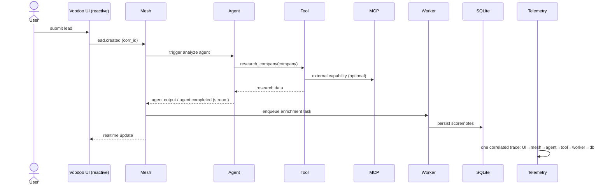

**5.4 Packaging & installation** (G17, G20)
- [ ] Optional extras wired: `voodoo[ai]` (all providers), `voodoo[mcp]`, `voodoo[dev]`; core install stays lean (providers lazy)
- [ ] Clean-env validation: `uv tool install voodoo-framework` → `voodoo new test_app` → `voodoo dev` works with zero manual steps

**Exit criteria**
- Quality gate green: `pytest` + mypy + ruff + package build + install test + CLI smoke + docs build + security + integration, from a clean environment
- Demo runs; a viewer understands "this isn't just Python rendering HTML"

---

### Phase 6 — Freeze & Release

**Goal:** Ship 1.0 with a stable, small, documented API.

- [ ] Freeze public API (contract tests marked `semver: 1.0`)
- [ ] Remove dead/duplicate code found since Phase 0; remove accidental exports
- [ ] Final docs pass; deprecation notices accurate; README final
- [ ] Full suite + benchmarks from clean environment; changelog
- [ ] Tag release; announce with the honest positioning

**Release gate = §15 checklist, all boxes ticked.**

---

## 8. Roadmap Overview

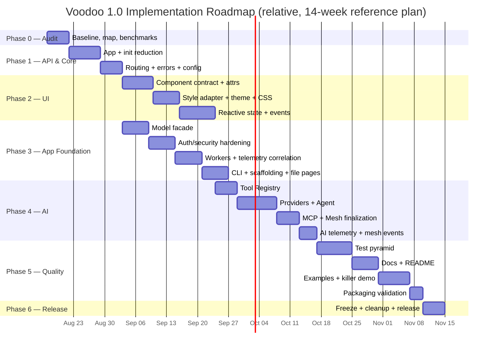

> Durations are a planning reference, not commitments. **Order and exit criteria are the contract.** Phases 2 and 3 can run in parallel tracks once Phase 1 exits.

---

## 9. Cross-Cutting Workstreams

### 9.1 Backwards Compatibility Protocol

Every breaking-adjacent change follows:

```mermaid
flowchart LR
    A[Existing API<br/>e.g. create_app] --> B[Add target API<br/>App]
    B --> C[Old API delegates to new impl]
    C --> D[DeprecationWarning + docs]
    D --> E[Contract tests cover both]
    E --> F[Remove only with strong reason<br/>(not during 1.0 cycle)]
```

- Inspect existing tests/examples before changing public behavior; preserve documented APIs
- Pydantic/Starlette/aiosqlite stay underneath — Voodoo remains interoperable with the Python ecosystem (users can still use SQLAlchemy, httpx, pytest, FastAPI alongside)

### 9.2 Testing Strategy Summary

| Level | Scope | Gate |
|---|---|---|
| Contract | `__all__`, signatures, deprecated aliases | CI-blocking |
| Unit | Every §6 primitive: happy, invalid input, async behavior | CI-blocking |
| Integration | Cross-subsystem flows (§5.1) | CI-blocking |
| Security | Threat model coverage (§10) | CI-blocking |
| Benchmarks | Startup, latency, render, WS, state, agent stream | Warn → block after baseline |
| E2E | Scaffold → dev → routes → doctor; examples | Pre-release |

CI rules: no network (mock provider), no real secrets, tests run against installed package (not source tree) once packaging lands.

### 9.3 Dependency & Packaging Policy

- **Mandatory core stays minimal:** starlette, uvicorn, pydantic, aiosqlite, websockets, httpx, python-dotenv, typer, rich, aiofiles
- **Optional extras:** `ai` (openai/anthropic/gemini/ollama — lazy import), `mcp`, `postgres`, `redis`, `dev`
- Core ≠ provider-specific logic: provider SDKs only inside `ai/providers/`
- Package data must include `client.js` (already configured — verify in clean install test)

### 9.4 Refactoring Safety Rule

```text
working implementation → new abstraction → tests → migration → remove duplication

NEVER: delete everything → rewrite → hope tests pass
```

---

## 10. Security Threat Model

Design knowing these exist; solve what 1.0 must, document the rest.

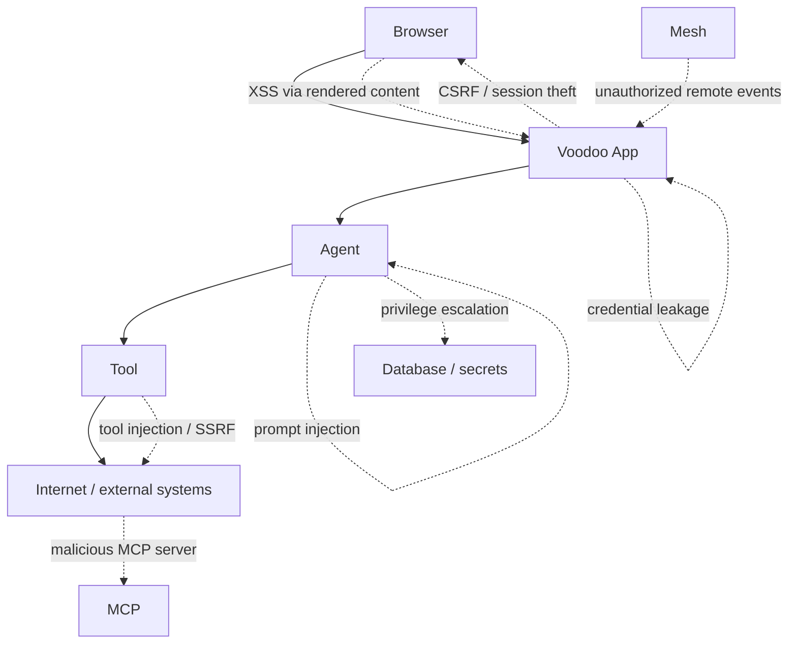

| Threat | 1.0 Stance |
|---|---|
| XSS via component content | Enforced escaping in the single rendering path; `Text` never raw-injects (explicit raw escape hatch if provided) |
| Prompt injection | Document; agent output never executed (no eval/JS/shell from LLM output — hard rule) |
| Tool injection / SSRF | Tools are explicit capabilities; internet access only via tools (`browse`), never an invisible superpower |
| Malicious MCP servers | Tool permissions metadata now; enforcement/allowlists = extension point |
| Credential leakage | Capability-scoped secrets — tools receive only what they need; never blanket env access to agents |
| Unauthorized Mesh (future remote) | Local ≠ remote boundary enforced now; auth/signing/replay/rate-limit required before any remote mesh ships |
| Agent privilege escalation | Agent gets ONLY its declared tools; no filesystem/network/env by default — foundational principle |
| Error leakage | Dev mode diagnostics; production hides stacks/secrets/paths/env |
| CSRF / cookies / JWT | Secure defaults: HttpOnly, SameSite, Secure-in-prod, expiry, strong hashing params |
| Generated UI | Future generative UI must render through validated component schemas — never raw LLM HTML/JS |

---

## 11. Performance Targets

*Targets, not guarantees — measured against Phase 0 baseline; benchmark before optimizing; never trade API simplicity for micro-optimizations.*

| Metric | Target | Comparator |
|---|---|---|
| Startup, minimal app | < 500 ms | vs Phase 0 baseline |
| Minimal request overhead | ≈ Starlette + ε | Starlette, FastAPI |
| SSR first response | Fast; no client-blocked render | Flask, Reflex |
| WebSocket event propagation | Low-latency local dispatch | — |
| State update payload | Minimal DOM delta, not full re-render | Reflex-style full swap |
| CLI project creation | Near-instant | — |
| Agent streaming | First token ≈ provider latency | provider SDK direct |

Priority order for optimization effort: startup → request latency → rendering → state updates → event dispatch → mesh latency → db ops → agent streaming.

---

## 12. Architecture Decision Records (Key Decisions)

| # | Decision | Rationale | Consequence |
|---|---|---|---|
| ADR-1 | `App` class wraps existing `create_app` (no rewrite) | Spec §54/§97: evolve working code | Compat alias retained through 1.0 |
| ADR-2 | Flat modules migrate to subpackages **incrementally**; old import paths re-export | Avoid big-bang risk | Appendix A map governs order |
| ADR-3 | One `ToolRegistry`; no `@agent_tool`/`@mcp_tool` duplicates | Spec §18/§77 — one tool, many consumers | MCP layer refactored onto registry |
| ADR-4 | Providers are optional extras with lazy imports | Minimal install (spec §148) | `voodoo[ai]` extra; clear errors if missing |
| ADR-5 | Tailwind isolated in `adapters/tailwind`; `StyleAdapter` is the only seam | Voodoo ≠ Tailwind (spec §9) | Components carry semantic props only |
| ADR-6 | SSR-first + minimal JS runtime; no virtual DOM, no JSX, no React clone | Spec §67/§68 | Small `client.js`; progressive enhancement |
| ADR-7 | State = observable server-side primitive; transport hidden | Spec §14 | WS internals stay private |
| ADR-8 | Correlation IDs via ContextVar propagated across mesh/worker/agent/tool | Foundation for autonomous debugging (§128/§129) | Telemetry spans share carrier |
| ADR-9 | SQLite default; storage boundary designed for future Postgres adapter | Zero-config + extensibility (§86) | No ORM lock-in in public API |
| ADR-10 | Evolution Engine stays OUT of core; 1.0 only leaves seams (registries, telemetry, capabilities) | Spec §43, final advice | Guardrails in §16 |
| ADR-11 | Public API frozen by contract test at release | Stability (§37) | Adding exports later = minor version |
| ADR-12 | Honest marketing: "built for the future of adaptive applications" | Trust (§164) | No self-evolution claims |

---

## 13. Risk Register

| ID | Risk | Likelihood | Impact | Mitigation |
|---|---|---|---|---|
| R1 | Scope creep — agent implements 50 unrequested features | **High** | High | §14 non-goals enforced; decision test (§3.1) on every PR |
| R2 | Rewrite-instinct breaks working subsystems | High | High | §9.4 protocol; golden tests from Phase 0; compat aliases |
| R3 | State/browser sync turns into hidden React clone | Medium | High | ADR-6; SSR-first; minimal-JS budget; review rule |
| R4 | Provider abstraction bloats into proprietary LLM SDK | Medium | Medium | Thin `LLMProvider` interface only; ADR-4 |
| R5 | `__init__` reduction breaks downstream users | Medium | Medium | Re-export shims + DeprecationWarning; contract tests |
| R6 | Telemetry becomes perf bottleneck | Low | Medium | Sampling knobs; async span export; benchmarks gate |
| R7 | Mesh scope creep toward distributed system | Medium | High | 1.0 = local mesh only; remote requires §10 auth set |
| R8 | Agent tests flaky with network deps | High | Medium | Deterministic mock provider in CI; no network rule |
| R9 | Tailwind extraction regressions in rendering | Medium | Medium | Golden render tests before/after adapter split |
| R10 | Multi-process deployments break in-memory state/mesh | Low | Medium | Document scope (§ spec 152/153); stateless HTTP default |

---

## 14. Non-Goals — Do NOT Build in 1.0

> An AI coding agent will happily implement all of these and make the framework worse. **This list is law.**

**Autonomy (future Evolution Engine):**
- ❌ Self-modifying production code · autonomous GitHub commits · autonomous deployments
- ❌ Self-replicating agents · autonomous revenue generation · autonomous DB migrations
- ❌ Automatic code mutation · automatic dependency installation
- ❌ Complex distributed Mesh across arbitrary internet hosts

**Framework bloat:**
- ❌ Custom programming language / JSX equivalent / templating DSL
- ❌ Full React clone (virtual DOM, hooks, lifecycle semantics, client component state)
- ❌ Custom CSS framework · custom JavaScript framework
- ❌ Giant LLM abstraction layer · custom LLM training infra
- ❌ Vector database abstraction · complex agent memory system
- ❌ Celery replacement · distributed database · Kubernetes orchestration
- ❌ Massive plugin marketplace · proprietary hosting requirement
- ❌ Dozens of UI components · hundreds of CLI commands

**Boundaries kept clean:**
- ✅ Registries, correlation IDs, tool permissions metadata, capability seams = **in** (future-ready)
- ❌ Policy engines, sandbox runners, fitness functions, Git automation = **out** (2.0)

---

## 15. Definition of Done — Voodoo 1.0

Every box must be ticked before the release tag.

**Foundation**
- [ ] Repository fully audited (Phase 0 map) · existing tests pass at baseline
- [ ] `App` finalized · routing finalized · component API finalized
- [ ] PascalCase components · lowercase decorators/runtime APIs — verified by contract test

**UI**
- [ ] Semantic HTML components · accessibility defaults
- [ ] Reactive state · Python-native events
- [ ] WebSocket implementation fully hidden behind state/event APIs
- [ ] Tailwind isolated as adapter · custom CSS supported · theme abstraction final

**Application**
- [ ] Model API simplified · authentication hardened · security reviewed
- [ ] Workers/queue stabilized · retries/timeouts/telemetry

**AI**
- [ ] Tool abstraction final (one tool → Python/Agent/MCP/Mesh)
- [ ] Real Agent provider abstraction (openai/anthropic/gemini/ollama, extras)
- [ ] Agent streaming (normalized events) · agent tools · agent runs
- [ ] MCP consumes Tool Registry · Mesh API final (`emit`/`on`/`expose`)
- [ ] Agent↔Mesh↔MCP integration proven · AI token/cost telemetry

**Quality & Release**
- [ ] Telemetry unified + correlation IDs end-to-end
- [ ] CLI finalized · scaffolding finalized · file-based pages work
- [ ] Public API contract tests · security tests · integration tests
- [ ] Performance baseline established (Phase 0) and not regressed
- [ ] Documentation complete (16 sections) · README rewritten on AI-native thesis
- [ ] Killer AI application (`examples/ai_saas`) demonstrates full chain
- [ ] Clean install (`uv tool install`) → `voodoo new` → `voodoo dev` verified
- [ ] Packaging tested from clean environment · quality gate green
- [ ] No proprietary CSS framework · no React-like abstractions · no Evolution Engine
- [ ] No autonomous production modification · no unrestricted agent capabilities
- [ ] Spec §104 acceptance app understood by a fresh developer without framework-internal knowledge
- [ ] **Voodoo 1.0 tagged and released**

---

## 16. Future Guardrails — Evolution Engine (2.0)

Out of scope for implementation, but 1.0 architecture must not block it.

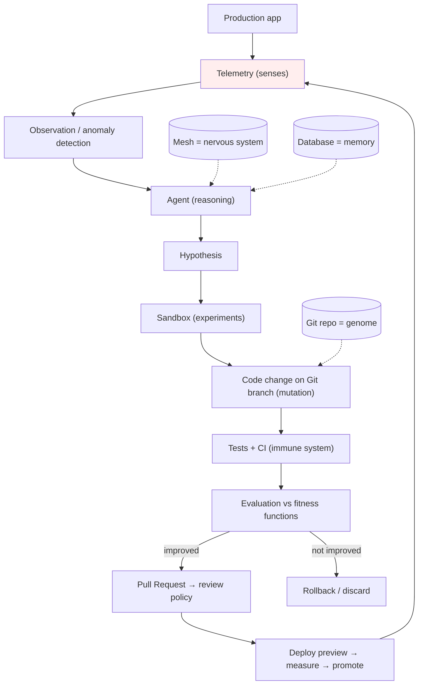

**1.0 must provide (and only these):** telemetry with correlation (senses), registries with structured metadata (introspection), tool capability/permission metadata (safety seams), Mesh namespaces (nervous system), agent runs (auditability).

**Future autonomy levels (permission ladder):** L0 Observe → L1 Suggest → L2 Implement (branch/PR) → L3 Deploy (staging/preview) → L4 Autonomous (policy-gated promotion). Agents never inherit unrestricted access by default; secrets are capability-scoped; changes flow through branch → tests → PR → CI → evaluation → promotion, with rollback.

---

## Appendix A — Module Migration Map

| Current (flat) | Target | Migration note |
|---|---|---|
| `core.py` (`create_app`, `ws_manager`, `register_event`) | `core/app.py` + `ui/events.py` | `App` wraps factory; `create_app` alias |
| `components.py` | `ui/components.py` | Port onto new `Component` base component-by-component |
| `agent.py` | `ai/agent.py`, `ai/providers.py`, `ai/tools.py` | Rebuild behind thin public `Agent` |
| `api.py` | `routing/api.py` | Namespace object preserved |
| `auth.py` | `auth/` | Harden + reduce exports; internals to subpackage |
| `security.py` | `security/` | Middleware stack unchanged, reviewed |
| `data.py` | `data/` | Add `Model` facade over `BaseModel` |
| `mesh.py` | `mesh/` | Envelope + verbs; namespaces |
| `mcp.py` | `mcp/` | Refactor onto `ToolRegistry` |
| `queue.py` | `workers/` | `@task` facade + retry/timeout/telemetry |
| `telemetry.py` | `telemetry/` | Correlation carrier + AI metrics |
| `theme.py` | `ui/styles/theme.py` | Semantic tokens consumed by `StyleAdapter` |
| `seo.py`, `i18n.py`, `storage.py`, `status.py` | same-name subpackages | Stabilize; exports mostly internal/subpackage |
| `config.py` | `core/config.py` | Env-driven, secure defaults |
| `cli.py` | `cli/` | Split per command; finalize core set |
| `client.js` | `static/client.js` | Minimal runtime; grows only for state/events |

During migration, each old path re-exports from the new location (import-compat), so user code and tests keep working until deliberate removal.

---

## Appendix B — The API Decision Test (pocket card)

```text
Before ANY implementation decision, ask in order:
1. Does it make the developer API simpler?        If no → stop.
2. Does it expose an implementation detail?       If yes → hide it.
3. Can plain Python express it?                   If yes → no DSL.
4. Is it provider/styling/infra-specific?         If yes → adapter/plugin.
5. Does it serve future Agent/Mesh/Evolution?     If yes → design the seam.
6. Is it necessary for 1.0?                       If no → defer.

Final check: "Can a Python developer understand this just by reading it?"

Voodoo = Python + Web + AI + Realtime + Events + Tools
         without feeling like six separate frameworks.

Minimal on the surface, powerful underneath.
Simple for humans, structured for AI.
Build the smallest, cleanest foundation that makes the vision possible.
```

---

*Maintained as the single source of truth for Voodoo 1.0 development. Update §7 exit criteria and §13 risks as work progresses; changes to §6 (API contract) require maintainer approval.*
