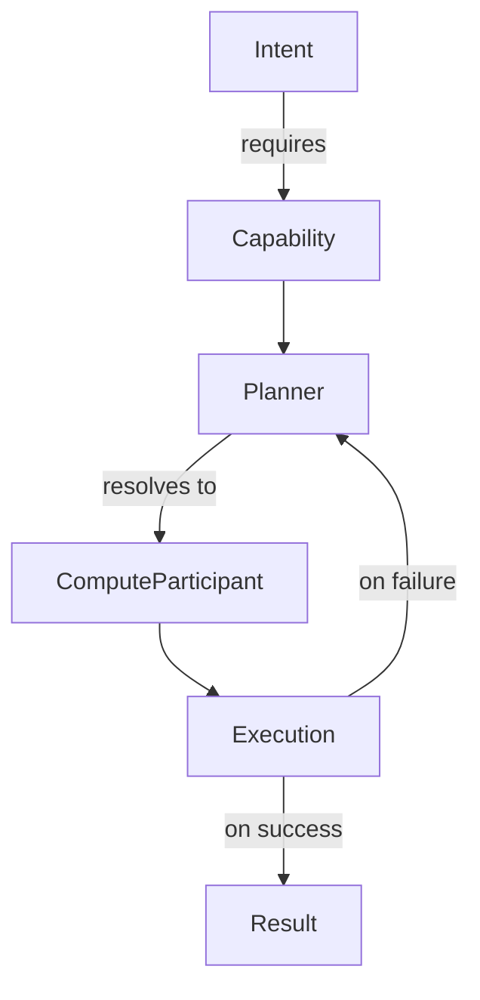

# Planner & Adaptive Runtime

> **Status:** Implemented. Adaptive supervisor with retry, fallback,
> delegation, and budget steering is live.

Voodoo's adaptive runtime is the layer that makes executions resilient.
When a capability fails, the planner can resolve an alternative compute
participant. When an execution struggles, the supervisor can retry,
fallback, delegate, or steer the budget.

## Planner

The `Planner` resolves **capabilities** to **compute participants**.
Given an intent that requires a capability, the planner determines which
agent, tool, model, or human can fulfill it.



### Capability Resolution

```python
from voodoo.runtime import Planner, ComputeParticipant

planner = Planner()

# Register participants
planner.register(
    ComputeParticipant(
        name="gpt-4o",
        capabilities=["reasoning", "tool_use", "vision"],
        cost_per_token=0.005,
    )
)

planner.register(
    ComputeParticipant(
        name="gpt-4o-mini",
        capabilities=["reasoning", "tool_use"],
        cost_per_token=0.0003,
    )
)

# Resolve the best participant for a capability
plan = planner.plan(intent, required_capabilities=["reasoning"])
# → selects gpt-4o-mini (cheaper, satisfies the capability)
```

### Fallbacks

When the primary participant fails, the planner can resolve a fallback:

```python
plan = planner.plan(
    intent,
    required_capabilities=["reasoning"],
    fallback=True,  # allow lower-tier participants
)
```

## Adaptive Supervisor

The `AdaptiveSupervisor` wraps execution with a control loop that
monitors progress and intervenes when things go wrong.

```python
from voodoo.runtime import AdaptiveSupervisor, SupervisorConfig

supervisor = AdaptiveSupervisor(
    config=SupervisorConfig(
        max_retries=3,
        max_cost=1.0,  # USD
        max_duration=300,  # seconds
        fallback_on_failure=True,
        delegate_on_timeout=True,
    )
)

run = await supervisor.supervise(execution)
```

### Supervisor Decisions

The supervisor can make the following decisions:

| Decision | When | Effect |
|----------|------|--------|
| **Retry** | Transient failure (timeout, rate limit) | Re-run with backoff |
| **Fallback** | Repeated failure on same participant | Switch to alternative |
| **Delegate** | Execution exceeds budget or timeout | Hand off to a different capability |
| **Steer** | Execution drifting (too many tokens, too slow) | Adjust parameters mid-flight |
| **Cancel** | Budget exhausted or constraint violated | Terminate execution |

### Constraint-Driven Retry Hints

When a retry is needed, the supervisor provides **hints** based on the
failure cause:

```python
from voodoo.runtime import SupervisorDecision

# The supervisor returns a decision with context
decision = SupervisorDecision(
    action="retry",
    reason="rate_limit_exceeded",
    hint={"delay": 5, "reduce_tokens": True},
)
```

## Resource Accounting

The `ResourceAccountant` tracks resource consumption across executions:

- **Compute** — tokens, API calls, CPU time
- **Time** — wall-clock duration
- **Cost** — dollar amount
- **Custom resources** — any named budget

```python
from voodoo.runtime import ResourceAccountant

accountant = ResourceAccountant(
    budget={
        "cost": 10.0,  # max $10 per execution
        "tokens": 100_000,  # max 100k tokens
        "duration": 600,  # max 10 minutes
    }
)

# The accountant enforces limits during execution
# Violations raise ResourceExceeded
```

## Constraint Enforcement

The `ConstraintEnforcer` validates that executions stay within declared
constraints before, during, and after compute:

```python
from voodoo.primitives import Constraint
from voodoo.runtime import ConstraintEnforcer

enforcer = ConstraintEnforcer(
    constraints=[
        Constraint.max_cost(1.0),
        Constraint.max_duration(60),
        Constraint.require_capability("tool_use"),
    ]
)
```

## See Also

- [Runtime Engine](runtime.md)
- [Computational Model](primitives.md)
- [Agents](agents.md)
- [ROADMAP.md §51–52 — Planner & Adaptive Runtime](../ROADMAP.md)
