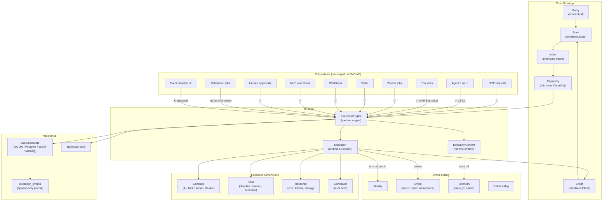

# Voodoo Architecture Review — v2.5.2

> **Date:** 2026-08-29 (original v2.5.0), updated 2026-03-15 (v2.5.2 stabilization)
> **Scope:** Sprints 1–22, version 2.5.0 → v2.5.2 architecture stabilization
> **Purpose:** Architectural clarification and stabilization before the next feature cycle.
> **Method:** Code is the source of truth. Documentation claims were verified against implementation.

---

## Table of Contents

- [Executive Summary](#executive-summary)
- [Architectural Verdict](#architectural-verdict)
- [Canonical Model](#canonical-model)
- [Source of Truth Matrix](#source-of-truth-matrix)
- [Execution Convergence Matrix](#execution-convergence-matrix)
- [Lifecycle Audit](#lifecycle-audit)
- [Durability Audit](#durability-audit)
- [Security Audit](#security-audit)
- [Agent Audit](#agent-audit)
- [HITL Audit](#hitl-audit)
- [Protocol Audit](#protocol-audit)
- [Storage Audit](#storage-audit)
- [Core Boundary Audit](#core-boundary-audit)
- [Documentation Drift](#documentation-drift)
- [API / DX Audit](#api--dx-audit)
- [Test Audit](#test-audit)
- [Architectural Debt](#architectural-debt)
- [Recommended Changes](#recommended-changes)
- [Explicit Non-Changes](#explicit-non-changes)
- [Post-Review Architecture](#post-review-architecture)
- [Next Development Cycle](#next-development-cycle)

---

## Executive Summary

Voodoo v2.5.2 is a **programmable runtime for adaptive applications and operational systems** built on Starlette, Uvicorn, Pydantic, aiosqlite, and Python asyncio. It is zero-config by default (SQLite + local filesystem) and production-ready by configuration (PostgreSQL, Redis, S3, OpenAI/Anthropic).

**What it actually is today:** A well-structured Python framework with a durable execution engine, capability-based security, human-in-the-loop approvals, an agent system, a mesh event bus, MCP integration, a reactive UI layer, and a protocol schema boundary. The runtime has 22 sprints of incremental development behind it, with strong local-first defaults and honest provider adapters.

**What changed in v2.5.2:** The architecture stabilization (REVIEW_PLAN.md) closed the largest convergence gap — the agent system now creates Executions through the ExecutionEngine. Tool calls create child Executions with their own lifecycle, capability context, and trace context. `AgentRun` is explicitly a projection of the underlying Execution, not a parallel record. Transition validation, lifecycle hardening, and durability semantics were formalized.

**The core thesis holds.** Entity → State → Intent → Capability → Execution → Effect → State is a sound computational model. No fundamental contradiction was found. The v2.5.0 gaps were implementation gaps, not conceptual ones — and v2.5.2 has closed the most critical ones.

---

## Architectural Verdict

### What is strong

1. **The computational model is sound.** The 8 primitives (Entity, State, Intent, Capability, Execution, Effect, Time, Resource, Constraint) form a coherent ontology. The convergence thesis — that web, agents, workers, tools, MCP, humans, and devices are all Executions — is architecturally correct.

2. **The execution engine is well-designed.** `ExecutionEngine` provides a single gateway with capability resolution, constraint enforcement, resource accounting, and approval management. The `ExecutionContext` propagation via ContextVars is clean.

3. **HITL works correctly.** Durable approvals survive process restart. The participant registry re-resolves compute after crash. Parent/child execution semantics on resume are correct.

4. **The storage adapter layer is honest.** SQLite, PostgreSQL, Redis, S3, and memory adapters implement the same Protocols with explicit capability flags. Contract tests enforce semantic parity. The adapter layer does not pretend that SQLite has the same concurrency as PostgreSQL.

5. **The DX ramp is well-designed.** Progressive complexity from 10-line hello world to 120-line production app. Zero config at levels 1–5. `voodoo create` scaffolds a working app with durable tasks, agent, and crash/restart demo.

6. **Security is capability-based, not role-based.** Sensitive capabilities (`filesystem.write`, `network.request`, `shell.execute`, `secrets.read`, `payment.execute`, `email.send`) are denied by default. No ambient authority for sensitive operations.

7. **Observability is built in.** `trace_id` propagates through HTTP, agents, tools, workers, queue tasks, mesh events, MCP, HITL, and child executions via ContextVar. Telemetry ring buffers prevent unbounded growth.

### What is weak

1. **~~Agent bypasses ExecutionEngine.~~** ✅ **FIXED in v2.5.2.** `Agent.run()` now creates Executions through the ExecutionEngine. Tool calls create child Executions. `AgentRun` is a projection of the underlying Execution.

2. **~~No transition validation.~~** ✅ **FIXED in v2.5.1.** `Execution._transition()` now validates against `LEGAL_TRANSITIONS` dict. Illegal transitions raise `ValueError`.

3. **Protocol/runtime type mismatch.** `Execution.state_changes` is `list[State]` in the runtime but `list[dict[str, Any]]` in the protocol. Conversion methods exist (`from_runtime_execution()` / `to_runtime_execution()`) but the dual representation remains.

4. **Dual definitions.** `AgentEntity`, `Approval`, and `Capability` exist in both protocol (Pydantic BaseModel) and runtime (dataclass or different Pydantic model) with divergent field sets. Updating one without the other creates drift.

5. **~~Checkpoint is not crash-safe.~~** ⚠️ **DOCUMENTED honestly in v2.5.2.** The guarantee is at-least-once with caller-enforced idempotency. Idempotency keys exist but the engine doesn't enforce exactly-once automatically.

### What is misunderstood

1. **~~"Every agent run is an Execution"~~** — ✅ **TRUE as of v2.5.2.** `Agent.run()` now creates an `Execution` through the ExecutionEngine when an engine is available.

2. **~~"13 lifecycle states"~~** — ✅ **FIXED in v2.5.2.** `docs/execution-model.md` now clearly separates implemented states (9) from aspirational states (5). The aspirational states are documented as not yet implemented.

3. **"Steer" supervisor decision** — documented in `docs/adaptive.md` but not implemented. The supervisor decisions are: `continue`, `retry`, `delegate`, `fallback`, `wait`, `request_approval`, `fail`.

4. **~~"Exactly-once semantics"~~** — ✅ **FIXED in v2.5.2.** Documentation now honestly states: at-least-once with idempotency key support for caller-enforced exactly-once.

---

## Canonical Model



---

## Source of Truth Matrix

| Concept | Authoritative Representation | Location | Notes |
|---|---|---|---|
| **Entity** | Ontological concept only | `primitives/__init__.py` | "Entity — anything that holds state (conceptual; represented via State)" |
| **Identity** | `Identity` (protocol schema) | `protocol/schemas.py` | Stable identity for any entity; `id`, `kind`, `owner` |
| **State** | `State` (Pydantic model) | `primitives/state.py` | Durable system truth; versioned, mutable, checkpointable |
| **Agent** | `Agent` (class) | `ai/agent.py` | Runtime compute participant; NOT a primitive |
| **AgentEntity** | `AgentEntity` (dataclass) | `agents/models.py` | Durable agent identity; **separate from Execution** |
| **AgentRunRecord** | `AgentRunRecord` (dataclass) | `agents/models.py` | Links agent run to execution; **projection of Execution** (v2.5.2) |
| **Execution** | `Execution` (Pydantic model) | `runtime/execution.py` | Canonical runtime record; serialized, checkpointable |
| **Memory** | `MemoryEntry` (dataclass) | `memory/interfaces.py` | Separate persistence; links to execution via `source_execution_id` |
| **Approval** | `Approval` (dataclass) | `runtime/human.py` | In-memory + persisted; linked to execution via `execution_id` |
| **Event** | `Event` (protocol schema) | `protocol/schemas.py` | Mesh event envelope; dotted namespace |
| **Journal** | `execution_events` table | `storage/execution/sqlite.py` | Append-only event log; canonical execution history |
| **Telemetry** | `TelemetryStore` + `Span` | `telemetry/store.py` | In-memory ring buffers + OTLP export; correlated via `trace_id_var` |
| **Capability** | `Capability` (Pydantic model) | `primitives/capability.py` | Runtime enforcement via `CapabilityResolver` |
| **Secret** | `SecretStore` Protocol | `security/secrets.py` | `EnvSecretStore` (default) or `LocalSecretStore` (Fernet) |
| **Effect** | `Effect` (Pydantic model) | `primitives/effect.py` | Side effect record; linked to intent via `intent_id` |

### Duplicated state risks

1. **~~`AgentRun` vs `Execution`~~** — ✅ **RESOLVED in v2.5.2.** `AgentRun` is now a projection of `Execution`, linked by `execution_id`. No longer parallel records.

2. **`AgentEntity` (dataclass) vs `AgentEntity` (protocol schema)** — structurally identical but separate types. Risk of drift if one is updated without the other.

3. **`Approval` (dataclass) vs `Approval` (protocol schema)** — same pattern as AgentEntity.

4. **`Capability` (primitive) vs `Capability` (protocol schema)** — two Pydantic models with overlapping but not identical fields.

5. **Telemetry vs Journal** — both record execution events. `TelemetryStore` records agent runs, tool calls, spans in memory; `execution_events` journal records execution lifecycle events in SQLite. Correlated via `trace_id` but independent stores.

6. **`ExecutionContext.capabilities` vs `Execution.capabilities`** — context holds live `Capability` objects; execution stores capability names (strings). Engine copies names from context to execution at creation time.

---

## Execution Convergence Matrix

| Subsystem | Creates Execution? | Uses ExecutionEngine? | Persisted? | Parent/child? | trace_id Propagates? | Recovery Possible? |
|---|---|---|---|---|---|---|
| **HTTP requests** | ✅ | ✅ (when `run_through_runtime=True`) | ✅ (if store attached) | ❌ | ✅ | ⚠️ Short-lived |
| **Agent runs** | ✅ (v2.5.2) | ✅ (v2.5.2) | ✅ (v2.5.2) | ✅ (v2.5.2) | ✅ | ✅ (v2.5.2) |
| **Tool calls via Agent** | ✅ (v2.5.2) | ✅ (v2.5.2) | ✅ (v2.5.2) | ✅ (v2.5.2) | ✅ | ✅ (v2.5.2) |
| **Tool calls via MCP** | ✅ | ✅ | ✅ | ❌ | ✅ | ⚠️ Short-lived |
| **Worker jobs** | ✅ | ✅ | ✅ | ❌ | ✅ | ✅ (queue retries) |
| **Queue tasks** | ✅ | ✅ | ✅ | ❌ | ✅ | ✅ |
| **Task** | ✅ | ✅ | ✅ | ✅ | ✅ | ✅ |
| **Workflow** | ✅ (per task) | ✅ | ✅ (per-task checkpoint) | ✅ | ✅ | ✅ |
| **HITL/Approvals** | ✅ | ✅ | ✅ | ✅ | ✅ | ✅ |
| **Scheduled jobs** | ❌ | ❌ (enqueues to queue) | ✅ (SQLite schedules) | ❌ | ❌ | ✅ (schedule survives restart) |
| **Event handlers** | ❌ | ❌ | ❌ (fire-and-forget) | ❌ | ⚠️ (correlation_id) | ❌ |
| **Browser events** | ❌ | ❌ | ❌ | ❌ | ❌ | ❌ |
| **Adaptive supervisor** | ✅ | ✅ | ✅ | ✅ | ✅ | ⚠️ (no checkpoint per step) |

### Remaining gaps

1. **Scheduled jobs are indirect.** `Scheduler.tick()` enqueues to the queue, which then runs through the worker, which then runs through the engine. The schedule itself has no execution record.

2. **Event handlers are fire-and-forget.** Mesh event handlers (`@mesh.on(...)`) do not create executions. A crashed handler is lost.

---

## Lifecycle Audit

### Implemented states (9)

```
CREATED → PLANNED → AUTHORIZED → RUNNING → WAITING
                                  ↕            ↓
                                  ↑        COMPLETED
                                (resume)     FAILED
                                             CANCELLED
                                             TIMED_OUT
```

### Documented states (14)

`docs/execution-model.md` documents: `created`, `validated`, `planned`, `authorized`, `running`, `completed`, `failed`, `cancelled`, `timed_out`, `blocked`, `waiting`, `paused`, `recovering`, `compensating`.

### Missing states (5)

| State | Documented? | Implemented? | Assessment |
|---|---|---|---|
| `validated` | ✅ | ❌ | Aspirational. Intent validation happens implicitly in `engine.execute()`. |
| `blocked` | ✅ | ❌ | Aspirational. No blocking mechanism exists. |
| `paused` | ✅ | ❌ | Aspirational. `WAITING` serves this purpose for HITL. |
| `recovering` | ✅ | ❌ | Aspirational. Crashed `RUNNING` executions are demoted to `WAITING`. |
| `compensating` | ✅ | ❌ | Aspirational. No compensation logic exists. |

### Transition validation

**✅ FIXED in v2.5.1.** `_transition()` now validates against `LEGAL_TRANSITIONS` dict. Illegal transitions raise `ValueError`. The `COMPLETED → RUNNING` transition is no longer possible.

### Documented transitions vs implemented transitions

| Transition | Documented | Implemented | Valid? |
|---|---|---|---|
| `created → validated` | ✅ | ❌ (no `validated` state) | N/A |
| `validated → planned` | ✅ | ❌ | N/A |
| `planned → rejected` | ✅ | ❌ (no `rejected` state) | N/A |
| `planned → authorized` | ✅ | ✅ (`mark_authorized()`) | ✅ |
| `authorized → running` | ✅ | ✅ (`start()`) | ✅ |
| `running → waiting` | ✅ | ✅ (`wait()`) | ✅ |
| `waiting → running` | ✅ | ✅ (`resume()`) | ✅ |
| `running → completed` | ✅ | ✅ (`complete()`) | ✅ |
| `running → failed` | ✅ | ✅ (`fail()`) | ✅ |
| `running → timed_out` | ✅ | ✅ (`time_out()`) | ✅ |
| `running → recovering` | ✅ | ❌ (no `recovering` state) | N/A |
| `failed → compensating` | ✅ | ❌ (no `compensating` state) | N/A |
| `COMPLETED → RUNNING` | ❌ | ✅ (no validation prevents it) | 🔴 **Illegal** |

### Recovery model

On crash, `engine.recover()`:
1. Loads all executions from the store
2. Filters to `UNFINISHED_STATUSES` = `CREATED | PLANNED | AUTHORIZED | RUNNING | WAITING`
3. **`RUNNING` executions are transitioned to `WAITING`** — this loses the distinction between "crashed mid-compute" and "waiting for human"
4. Restores executions into `engine.executions` dict
5. For `WAITING` executions, rehydrates approval records

**Assessment:** The `RUNNING → WAITING` demotion is the correct minimal model. A `RECOVERING` state would add complexity without changing behavior — the execution still needs to be re-driven from its checkpoint. The current model is honest: after crash, the execution is waiting for someone or something to resume it.

---

## Durability Audit

### Tracing a real execution through the full lifecycle

1. **Creation:** `engine.execute()` creates an `Execution` object, persists via `_persist()` (store.save), emits `execution.created` event.

2. **Persistence:** `SQLiteExecutionStore.save()` upserts the materialized row and appends a journal event. **⚠️ SQLite appends journal BEFORE upsert (FK-unsafe if FKs enabled). PostgreSQL upserts materialized FIRST (correct).**

3. **Compute:** The compute callable receives an `ExecutionContext`. Effects are recorded on the context.

4. **Checkpoint:** After compute, `_record_result()` lifts effects from context to execution, records state changes, and persists. The checkpoint payload includes `completed_effects` (effect IDs for idempotency skip).

5. **Effect:** Effects are applied by the compute callable. The engine records them on the execution after compute completes.

6. **Crash:** Process dies. In-flight async operations stop. The compute callable is gone.

7. **Restart:** `engine.recover()` loads unfinished executions. `RUNNING` → `WAITING`. Pending approvals rehydrated.

8. **Recovery:** For `WAITING` executions with a registered participant, `engine.approve()` re-resolves compute from the participant registry.

9. **Resume:** `engine.approve()` creates a child execution with the approval decision in context metadata. The child runs the compute.

10. **Completion:** Child execution completes. Parent `WAITING` execution is completed with the child's result.

### What is actually guaranteed

| Guarantee | Claimed? | Implemented? | Assessment |
|---|---|---|---|
| **At-least-once delivery** | ✅ | ✅ | Queue retries ensure at-least-once |
| **Exactly-once effects** | Implied | ⚠️ | Idempotency keys exist but caller must check `resume_checkpoint()` |
| **Crash-safe checkpoints** | Implied | ❌ | No fsync/WAL barrier between effect and checkpoint |
| **No duplicate effects after crash** | Implied | ⚠️ | Possible if crash happens between effect applied and checkpoint recorded |
| **Approval survives restart** | ✅ | ✅ | Sprint 18 durable HITL works correctly |
| **Schedule survives restart** | ✅ | ✅ | SQLite-backed scheduler |
| **Queue tasks survive restart** | ✅ | ✅ | SQLite/Postgres/Redis queue |

### Documentation claims stronger than implementation

- **"A process crash must not cause completed effects to execute again"** — this is the *intent*, not the *guarantee*. The implementation provides the building blocks (idempotency keys, checkpoint-resume) but does not enforce exactly-once automatically.
- **"Completed steps are not re-executed"** — true only if the checkpoint was written before the crash. A crash between effect and checkpoint breaks this.

---

## Security Audit

### Canonical authorization flow

```
principal → capability → authorization → execution → effect
```

### How it works

1. **`CapabilityResolver.authorize()`** checks: context-granted capabilities → registry → `SENSITIVE_CAPABILITIES` (denied by default).
2. **`SENSITIVE_CAPABILITIES`** (frozenset): `filesystem.write`, `network.request`, `shell.execute`, `secrets.read`, `payment.execute`, `email.send`.
3. **Three outcomes:** `ALLOWED`, `DENIED`, `REQUIRES_APPROVAL`.
4. **`CapabilityDenied`** or **`ApprovalRequired`** structured errors raised on denial/approval.

### What is strong

- No ambient authority for sensitive capabilities.
- Capabilities are explicit, scoped, delegatable, revocable, and time-limited.
- `RedactionGuard` scrubs secrets from events/journal/telemetry.
- `EnvSecretStore` (default) and `LocalSecretStore` (Fernet) provide secret management.
- CSRF, CORS, rate limiting, and security headers are implemented.

### Gaps

1. **Agent fallback path.** When no `ExecutionContext` exists, the agent falls back to its own `self.capabilities` list — a weaker enforcement path. An agent with broad capabilities could bypass context-scoped restrictions.

2. **Non-sensitive capabilities have a softer path.** If a capability is registered in the resolver and valid, it's allowed without explicit context grant. This is less strict than the sensitive-capability model.

3. **No capability delegation chain audit.** `Capability.delegate(to)` transfers capability but there's no audit trail of delegation chains.

4. **No secret leak tests.** No test verifies that secrets don't leak via telemetry, error messages, or mesh events.

---

## Agent Audit

### Agent/Execution relationship (v2.5.2)

**✅ FIXED in v2.5.2.** `Agent.run()` now creates an `Execution` through the `ExecutionEngine` when an engine is available.

1. **Engine-backed path** (`_run_via_engine()`): creates an `Intent` named `agent.{name}`, wraps the provider loop as a compute function, calls `engine.execute()`.

2. **Tool child Executions** (`_execute_tool_as_child_execution()`): creates a child `Execution` via `engine.execute()` with an `Intent` named `tool.{name}`, tool's required capabilities propagated.

3. **AgentRun as projection** — `AgentRun` is a projection of the underlying `Execution`. The `execution_id` field links the two. `trace_id` is the correlation id propagated through the entire stack.

4. **Standalone fallback** — When no engine is available, `Agent.run()` falls back to `_run_standalone()` which calls `_provider_loop()` directly. This preserves backward compatibility.

### trace_id propagation

`trace_id` propagates through agent runs:
- `Agent.run()` reads `trace_id` from `telemetry_store.trace_id_var`
- Stores it on `AgentRun.trace_id`
- `AgentRunRecord.trace_id` links to the execution
- Child tool executions inherit the trace_id from the parent context

### Assessment

The agent system is now **fully converged** with the ExecutionEngine. Agent runs are visible in `voodoo inspect executions`, tool calls go through capability enforcement, agent runs have checkpoints and recovery, and tool calls create parent/child relationships.

---

## HITL Audit

### Approval flow

1. **Request:** `ExecutionEngine.execute()` catches `ApprovalRequired` → execution enters `WAITING` → `ApprovalRegistry.create()` → persisted via `_persist_approval()` → journal event `approval.requested`.

2. **Approve:** `engine.approve(execution_id, by="admin")` → `ApprovalRegistry.decide()` → journal event `approval.granted` → resumes as child execution with approval in context metadata.

3. **Deny:** `engine.deny(execution_id, by="admin")` → execution fails with denial reason → journal event `approval.denied`.

### What is strong

- Approvals are persisted (Sprint 4+).
- Participant registry re-resolves compute after crash (Sprint 18).
- Duplicate decisions are prevented (`ApprovalRegistry.decide()` checks `approval.decided`).
- Parent/child execution semantics on resume are correct.
- Audit trail via journal events.

### Gaps

1. **No approval timeout test.** No test verifies that an approval times out correctly.
2. **No concurrent decision test.** No test verifies behavior when two processes try to approve the same execution simultaneously.
3. **No denial → compensation test.** No test verifies that denying an approval triggers compensation for reversible effects.

### Assessment

Approval is correctly modeled as an Execution transition. The `WAITING` state, participant registry, and durable resume path form a coherent HITL system. The gaps are test coverage gaps, not architectural gaps.

---

## Protocol Audit

### Schema/domain boundaries

The protocol layer (`voodoo.protocol`) defines 18 Pydantic models as the stable semantic boundary for cross-language interop. Each model carries `schema_version: int = Field(default=SCHEMA_VERSION, ge=1)`.

### Issues

1. **Dual `Execution` models.** Protocol `Execution.state_changes` is `list[dict[str, Any]]`; runtime `Execution.state_changes` is `list[State]`. Cannot round-trip without a conversion layer.

2. **Dual `ExecutionStatus` enums.** Both protocol and runtime define `ExecutionStatus` with identical values. Protocol version is bare `StrEnum`; runtime version adds `.terminal` and `.active` properties.

3. **Dual primitive models.** Protocol redefines `Capability`, `Constraint`, `Resource`, `Intent`, `Effect` with `schema_version`. Runtime versions don't have `schema_version`. Field sets overlap but are not identical.

4. **`datetime.utcnow()` deprecation.** All 14 protocol schema default factories use `datetime.utcnow()` which is deprecated since Python 3.12. Runtime uses `datetime.now(UTC)` correctly.

5. **`AgentEntity` (dataclass) vs `AgentEntity` (protocol schema).** Structurally identical but separate types.

6. **`Approval` (dataclass) vs `Approval` (protocol schema).** Same pattern.

### Assessment

The protocol layer is a **pure serialization model** — it should not have lifecycle methods or runtime behavior. The dual definitions are intentional (runtime vs protocol) but need conversion methods to bridge the gap. The `datetime.utcnow()` deprecation is a straightforward fix.

---

## Storage Audit

### SQLite vs PostgreSQL semantic equivalence

| Aspect | SQLite | PostgreSQL | Equivalence |
|---|---|---|---|
| Placeholders | `?` | `%s` (via `_translate()`) | ✅ |
| Auto-increment | `AUTOINCREMENT` | `IDENTITY` | ✅ |
| JSON columns | TEXT (no native JSON) | TEXT (for parity) | ✅ |
| Concurrent writers | ❌ Single-writer | ✅ MVCC | ⚠️ **Capability difference** |
| FK enforcement | Off by default | Always on | ⚠️ **Behavior difference** |
| Transactions | ✅ | ✅ | ✅ |

### Execution store ordering difference

| Store | `save()` order | Correct? |
|---|---|---|
| `SQLiteExecutionStore` | Append journal FIRST, then upsert materialized | ⚠️ FK-unsafe if FKs enabled |
| `PostgresExecutionStore` | Upsert materialized FIRST, then append journal | ✅ Correct |

### Queue claiming strategy

| Aspect | SQLite | PostgreSQL | Redis |
|---|---|---|---|
| Claim mechanism | `UPDATE...RETURNING` | `FOR UPDATE SKIP LOCKED` | Atomic Lua script |
| Priority | No | No | ✅ ZSET score |
| Delayed delivery | No | No | ✅ ZSET score = timestamp |

### Assessment

The adapter layer exposes honest capabilities. SQLite and PostgreSQL are semantically equivalent for single-process use. The FK ordering difference in the execution store is a P0 fix — it should match PostgreSQL's behavior.

---

## Core Boundary Audit

| Module | Classification | Justification |
|---|---|---|
| `core/` | Core runtime | App facade, routing, errors, events, state |
| `primitives/` | Core runtime | 8 architectural primitives |
| `runtime/` | Core runtime | ExecutionEngine, context, planner, adaptive, human, persistence |
| `routing/` | Core runtime | Page registry, API routing |
| `config.py` | Core runtime | Config loading, env interpolation |
| `storage/database/sqlite.py` | Core runtime | Default database |
| `storage/queue/sqlite.py` | Core runtime | Default queue |
| `storage/events/sqlite.py` | Core runtime | Default event bus |
| `storage/execution/sqlite.py` | Core runtime | Default execution store |
| `adapters/` | Core runtime | Provider registry, capability system |
| `protocol/` | Core runtime | Schema definitions (pure Pydantic, no I/O) |
| `telemetry/` | Core runtime | In-process ring buffers, `trace_id_var` |
| `data/` | Core runtime | Async ORM (aiosqlite — base dependency) |
| `workers/` | Core runtime | `@task` decorator, in-process queue |
| `mesh/` | Core runtime | LocalEventBus (in-process) |
| `tools/` | Core runtime | Tool registry (in-process) |
| `schedule.py` | Core runtime | Durable scheduler (SQLite-backed) |
| `security/redaction.py` | Core runtime | RedactionGuard (regex-only, no deps) |
| `security/secrets.py` | Core runtime | `EnvSecretStore` default |
| `auth/` | Framework convenience | Not every app needs auth; always installed |
| `ui/` | Framework convenience | Not every app needs UI; always installed |
| `mcp/` | Framework convenience | SSE endpoint always registered |
| `memory/` | Core runtime | SQLite-backed, per-agent |
| `agents/` | Core runtime | SQLite-backed agent registry |
| `ai/` (providers) | Optional capability | `[ai]` extra; lazy imports |
| `storage/database/postgres.py` | Optional capability | `[postgres]` extra |
| `storage/queue/redis.py` | Optional capability | `[redis]` extra |
| `storage/objects/s3.py` | Optional capability | `[s3]` extra |
| `i18n.py` | Framework convenience | Internationalization |
| `seo.py` | Framework convenience | SEO/OpenGraph metadata |
| `cli/` | Framework convenience | Typer CLI |

### Boundary concerns

1. **Auth middleware auto-registers** — even API-only apps get `AuthMiddleware`. No opt-out.
2. **MCP SSE endpoint always registered** — `/mcp/sse` is wired even if the app doesn't use MCP.
3. **Telemetry middleware auto-installed** — `TelemetryMiddleware` is always active.

These add negligible overhead but violate the "minimal by default" principle.

---

## Documentation Drift

| # | Claim | Location | Severity | Assessment |
|---|---|---|---|---|
| 1 | ~~"Every agent run is an Execution"~~ | `docs/execution-model.md` | ✅ **FIXED** | True as of v2.5.2 |
| 2 | ~~14 lifecycle states documented~~ | `docs/execution-model.md` | ✅ **FIXED** | Now clearly separates implemented (9) vs aspirational (5) |
| 3 | "Steer" supervisor decision | `docs/adaptive.md` | 🟠 Important | Not implemented; decisions are: continue, retry, delegate, fallback, wait, request_approval, fail |
| 4 | `SupervisorConfig(max_cost=1.0, max_duration=300)` | `docs/adaptive.md` | 🟠 Important | Actual fields: `max_retries`, `max_iterations`, `budget` |
| 5 | `fallback_on_failure=True, delegate_on_timeout=True` | `docs/adaptive.md` | 🟠 Important | Not fields on `SupervisorConfig` |
| 6 | ~~"Exactly-once semantics" implied~~ | `docs/execution-model.md` | ✅ **FIXED** | Now honestly states at-least-once with idempotency keys |
| 7 | ~~"Completed steps are not re-executed"~~ | `docs/execution-model.md` | ✅ **FIXED** | Now documents checkpoint dependency |
| 8 | ~~`planned → rejected` transition~~ | `docs/execution-model.md` | ✅ **FIXED** | Removed from implemented transitions |
| 9 | ~~`running → recovering` transition~~ | `docs/execution-model.md` | ✅ **FIXED** | Removed from implemented transitions |
| 10 | ~~`failed → compensating` transition~~ | `docs/execution-model.md` | ✅ **FIXED** | Removed from implemented transitions |
| 11 | Protocol schemas use `datetime.utcnow()` | `src/voodoo/protocol/schemas.py` | 🟡 Minor | Deprecated since Python 3.12 |
| 12 | `voodoo new` in quick start | `README.md` | 🟢 Correct | `voodoo create` is now primary (Sprint 22) |
| 13 | Auth claims (PBKDF2, JWT, API keys, guards) | `docs/auth.md` | 🟢 Correct | All verified |
| 14 | Telemetry claims (trace_id, ring buffers, OTLP) | `docs/telemetry.md` | 🟢 Correct | All verified |
| 15 | Mesh claims (namespaced events, correlation_id) | `docs/mesh.md` | 🟢 Correct | All verified |
| 16 | MCP claims (@tool, SSE, client) | `docs/mcp.md` | 🟢 Correct | All verified |
| 17 | Workers claims (@task, retries, queue providers) | `docs/workers.md` | 🟢 Correct | All verified |
| 18 | Data layer claims (async SQLite, RLS, hooks) | `docs/data.md` | 🟢 Correct | All verified |
| 19 | State claims (reactive cells, subscribe, render) | `docs/state.md` | 🟢 Correct | All verified |

---

## API / DX Audit

### Progressive complexity assessment

| Level | Concept | Lines | Imports | Config | Assessment |
|---|---|---|---|---|---|
| 1 | Static page | ~10 | 1 | None | ✅ Clean |
| 2 | Reactive state + events | ~25 | 2 | None | ✅ Natural ramp |
| 3 | Components + layout | ~40 | 1 (wildcard) | None | ✅ Consistent API |
| 4 | AI agent + tools | ~50 | 3 | None (mock) | ✅ Good progressive complexity |
| 5 | Mesh + workers | ~60 | 3 | None | ✅ Clean |
| 6 | Auth + guards | ~80 | 4 | None | ✅ |
| 7 | Durable execution | ~100 | 5 | `voodoo.yaml` | ✅ |
| 8 | PostgreSQL + Redis | ~120 | 5 | Env vars | ✅ |

### DX concerns

1. **Import confusion:** `from voodoo import state` (UI reactive) vs `from voodoo.primitives import State` (runtime primitive) — same word, different concepts.
2. **Magic auto-registration:** `@tool`, `@event`, `@page` all register at import time. Convenient but side effects at import.
3. **Config surface:** `voodoo.toml`, `voodoo.yaml`, `VOODOO_*` env vars, and in-code config all work. Multiplicity can confuse newcomers.

### Assessment

The DX ramp is well-designed. Each level adds ~10–20 lines and 1–2 new concepts. The framework avoids "configuration hell" by being zero-config at levels 1–5.

---

## Test Audit

### Coverage by area

| Area | Covered | Missing |
|---|---|---|
| **Execution lifecycle** | Happy path, unauthorized effects, constraints, context propagation, parent/child, state changes, error identity, cancellation, retries, resource accounting | Cancel-after-completion, cancel-during-waiting, deadline enforcement, timeout-propagation-to-children |
| **Crash/restart recovery** | Checkpoint boundaries, resume skips completed effects, recovery running→waiting | Crash-during-effect (partial), corrupted checkpoint, concurrent recoveries |
| **Idempotency** | Idempotency key on effects, queue idempotency | Effect replay after crash, idempotency across providers |
| **Security** | Sensitive capability matrix (6 caps), effect auth context, secret stores, redaction patterns, CSRF, rate limiting | Secret leak via telemetry, secret leak via error messages |
| **HITL** | ask_human, task with human, workflow with human, approval participant, participant registry, durable persistence, crash-resume | Approval timeout→cancel, multiple pending approvals, denial→compensation |
| **Provider parity** | Database contract (7 tests), queue contract (16+ tests), event bus contract (7 tests) | Execution store parity (no contract test), cache parity |
| **Trace propagation** | trace_id_var set by middleware, trace in agent runs, trace in tool calls, trace across parent/child | Trace in queue tasks, trace in mesh events |

### High-priority gaps

1. No execution store contract test (SQLite vs Postgres parity)
2. No test for cancel-after-completion or cancel-during-waiting
3. No test for deadline enforcement in the engine
4. No test for crash-during-effect (partial execution)
5. No test for secret leak via telemetry/error messages
6. No test for approval timeout→cancel flow
7. No test for trace propagation through queue tasks and mesh events

---

## Architectural Debt

### P0 — Must fix before further feature development

| # | Issue | Impact | Fix | Status |
|---|---|---|---|---|
| P0-1 | ~~`_transition()` does no validation~~ | ~~Any state can go to any other state~~ | `LEGAL_TRANSITIONS` dict + validation | ✅ **FIXED v2.5.1** |
| P0-2 | Protocol/runtime `Execution` type mismatch | Cannot round-trip runtime Execution through protocol | `from_runtime_execution()` / `to_runtime_execution()` conversion methods | ✅ **FIXED v2.5.1** |
| P0-3 | `datetime.utcnow()` deprecation in protocol | 14 uses of deprecated API | Replace with `datetime.now(UTC)` | ✅ **FIXED v2.5.1** |
| P0-4 | SQLite execution store FK ordering | Journal appended before materialized row; FK-unsafe | Swap order to match PostgreSQL store | ✅ **FIXED v2.5.1** |

### P1 — Should fix before the next major runtime cycle

| # | Issue | Impact | Fix | Status |
|---|---|---|---|---|
| P1-1 | ~~Agent bypasses ExecutionEngine~~ | ~~Largest convergence gap~~ | Make `Agent.run()` create Executions | ✅ **FIXED v2.5.2** |
| P1-2 | Dual type definitions (AgentEntity, Approval, Capability) | Protocol and runtime can drift independently | Conversion layer or unified base | ⬜ Open |
| P1-3 | ~~No execution store contract test~~ | ~~SQLite/Postgres parity not enforced~~ | `TestExecutionStoreContract` mixin | ✅ **FIXED v2.5.1** |
| P1-4 | Checkpoint not crash-safe | At-least-once, not exactly-once | Document honestly; add fsync barrier in future | ✅ **Documented v2.5.2** |
| P1-5 | Event handlers are fire-and-forget | Crashed handlers are lost | Optional: create executions for event handlers | ⬜ Open |

### P2 — Can be addressed incrementally

| # | Issue | Impact | Fix |
|---|---|---|---|
| P2-1 | Auth/MCP/Telemetry auto-register with no opt-out | Minor DX concern | Config flags |
| P2-2 | `state()` naming collision (UI reactive vs runtime primitive) | Import confusion | Documentation clarification |
| P2-3 | Missing test coverage (cancel-after-completion, deadline enforcement, etc.) | Semantic gaps | Add tests incrementally |
| P2-4 | `JSONFileExecutionStore` unbounded growth | Long-running systems | Add compaction |
| P2-5 | `PostgresExecutionStore` uses synchronous connection | Blocks async event loop | Async connection pool |

### P3 — Future enhancement

| # | Issue | Impact | Fix |
|---|---|---|---|
| P3-1 | `RECOVERING` state | Distinguishes crash from human-wait | Evaluate after P1-1 (agent convergence) |
| P3-2 | Compensation logic | Undo reversible effects on failure | Dedicated sprint |
| P3-3 | Delegation chain audit trail | Security audit requirement | When delegation is used in production |
| P3-4 | Vector database memory adapter | Semantic search | When vendor-independent solution exists |

---

## Recommended Changes

### ~~Immediate (Sprint 22.1 — v2.5.1)~~ ✅ DONE

1. ✅ **Add transition validation** to `Execution._transition()` — `LEGAL_TRANSITIONS` dict, raise on illegal transitions.
2. ✅ **Add protocol/runtime conversion methods** — `from_runtime_execution()` / `to_runtime_execution()` on protocol `Execution`.
3. ✅ **Fix `datetime.utcnow()`** — replace all 14 occurrences in `protocol/schemas.py`.
4. ✅ **Fix SQLite FK ordering** — swap `save()` order to match PostgreSQL.
5. ✅ **Add execution store contract test** — `TestExecutionStoreContract` mixin.
6. ✅ **Fix documentation drift** — separate implemented vs aspirational states in `docs/execution-model.md`, fix `docs/adaptive.md` claims.

### ~~Next cycle (v2.5.2 — Architecture Stabilization)~~ ✅ DONE

1. ✅ **Agent convergence** — `Agent.run()` creates Executions through `ExecutionEngine`. Tool calls create child Executions. `AgentRun` is a projection.
2. ✅ **Lifecycle hardening** — Transition validation, crash/recovery semantics, durability documentation.
3. ✅ **Documentation synchronization** — All docs updated to match implementation.

### Future (Sprint 23+)

1. **Dual type unification** (P1-2) — Conversion methods or shared base for protocol/runtime `AgentEntity`, `Approval`, `Capability`.
2. **Event handler convergence** (P1-5) — Optional: create executions for mesh event handlers.
3. **Scheduler convergence** — Make scheduled jobs first-class Executions.
4. **Test coverage** (P2-3) — Cancel/timeout edge cases, secret leak tests, trace propagation through queue/mesh.

---

## Explicit Non-Changes

The following should NOT be changed:

1. **The computational model.** Entity → State → Intent → Capability → Execution → Effect → State is sound.
2. **The 8 primitives.** They form a coherent ontology. Do not add more.
3. **AI as one Compute.** AI is not a fundamental primitive. Do not promote it.
4. **Local-first defaults.** SQLite + local filesystem + in-memory queues are the defaults. Do not require external services.
5. **Capability-based security.** Do not weaken to role-based for convenience.
6. **The protocol layer.** It is a pure serialization model. Do not add runtime behavior to it.
7. **The adapter layer.** It exposes honest capabilities. Do not pretend SQLite has PostgreSQL's concurrency.
8. **The DX ramp.** Progressive complexity from 10-line hello world to 120-line production app.
9. **The HITL model.** Approval as an Execution transition is correct.
10. **The mesh event bus.** Namespaced events with correlation_id are correct.

---

## Post-Review Architecture

The architecture Voodoo should freeze around:

```text
                    ENTITY (conceptual)
                       │
                       ▼
                     STATE (primitives.State)
                       │
                       ▼
                    INTENT (primitives.Intent)
                       │
                       ▼
                 CAPABILITY (primitives.Capability)
                       │
                       ▼
                  EXECUTION (runtime.Execution)
                       │
          ┌────────────┼────────────┐
          │            │            │
       COMPUTE       TIME      CONSTRAINT
          │            │            │
          └────────────┼────────────┘
                       │
                    EFFECT (primitives.Effect)
                       │
                       ▼
                     STATE
```

**Execution is the central runtime mechanism.** Every meaningful operation should be an Execution. The agent system is the primary gap — it should create Executions through ExecutionEngine.

**The protocol layer is the serialization boundary.** Protocol schemas are pure data models with `schema_version`. They do not have lifecycle methods. Conversion methods bridge protocol and runtime.

**The storage layer is the persistence boundary.** SQLite is the default. PostgreSQL, Redis, S3 are optional upgrades. The adapter layer exposes honest capabilities.

**The security model is capability-based.** Sensitive capabilities are denied by default. No ambient authority. Capabilities are explicit, scoped, delegatable, revocable, and time-limited.

---

## Next Development Cycle

After v2.5.2, the recommended priority order is:

1. **Scheduler convergence** — Make scheduled jobs first-class Executions through the ExecutionEngine. This is the remaining convergence gap.

2. **Dual type unification** (P1-2) — Conversion methods for protocol/runtime `AgentEntity`, `Approval`, `Capability`.

3. **Event handler convergence** (P1-5) — Optional: create executions for mesh event handlers.

4. **Test coverage** (P2-3) — Cancel/timeout edge cases, secret leak tests, trace propagation through queue/mesh.

5. **Middleware opt-out** (P2-1) — Config flags for auth/MCP/telemetry auto-registration.

Sprint 23 (TypeScript SDK) can now proceed. The agent convergence gap is closed, and the protocol schemas accurately represent the runtime — including agent executions.
