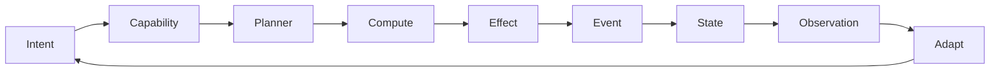

# Runtime Engine

> **Status:** Implemented (Sprints 1–7). Durable by default since v1.5.0.
> Architecture-stabilized in v2.5.2 — Agent converged with ExecutionEngine,
> tool calls create child Executions, lifecycle and durability semantics formalized.

The Voodoo Runtime Engine is the unified execution model that makes the
computational model operational. Every meaningful operation —
HTTP request, agent run, task, workflow step, tool invocation, MCP call,
worker job, human approval, event handler — is represented as an
**Execution** produced by a single `ExecutionEngine`.

## The Execution Lifecycle



## Core Concepts

### Execution

An `Execution` is the universal unit of work. Every operation produces
one, regardless of whether it's an HTTP request, an agent run, or a
background task.

```python
from voodoo.runtime import Execution, ExecutionStatus

# Executions flow through these statuses:
# PENDING → RUNNING → COMPLETED | FAILED | CANCELLED | WAITING
```

### ExecutionEngine

The `ExecutionEngine` (singleton: `engine`) drives the lifecycle:

```python
from voodoo.runtime import execute, Intent

result = await execute(
    Intent("qualify_customer", customer_id=123),
    capabilities=["customers:read", "customers:write"],
)
```

### ExecutionContext

Every execution carries an `ExecutionContext` with:

- **Correlation ID** — links related executions across the system
- **Causation ID** — links an execution to the one that caused it
- **Actor** — who initiated the execution
- **Capabilities** — what the execution is allowed to do
- **Resource budget** — compute, time, cost limits

### Durable Persistence

Executions are persisted to SQLite by default (`.voodoo/state/data.db`).
The `SQLiteExecutionStore` maintains:

- **`executions` table** — materialized execution state
- **`execution_events` table** — append-only journal of events

```bash
# Inspect executions
voodoo executions
voodoo execution <id>    # full timeline from journal
voodoo events            # event stream

# Recover unfinished executions after a restart
voodoo recover
```

## Checkpoints & Resume

Executions checkpoint at meaningful boundaries:

- After model completion
- After tool completion
- After state mutation
- After task scheduling
- Before waiting (human approval)

If the process crashes, `voodoo recover` restores unfinished executions
from their last checkpoint. Completed steps are not re-executed.

## Artifacts & Provenance

Agent and tool outputs can be stored as **artifacts** with full
provenance tracking:

```bash
voodoo artifacts <execution_id>   # view artifact chain
```

## Configuration

The runtime is configured via `voodoo.yaml` (or environment variables):

```yaml
database:
  provider: sqlite          # sqlite (default) | postgres
queue:
  provider: sqlite          # sqlite (default) | postgres | redis
events:
  provider: sqlite          # sqlite (default) | postgres | memory
objects:
  provider: local           # local (default) | s3
cache:
  provider: memory          # memory (default) | redis
```

All defaults are local-first and require zero external infrastructure.

## See Also

- [Computational Model](primitives.md)
- [Human-in-the-Loop](hitl.md)
- [Planner & Adaptive Runtime](adaptive.md)
- [Architecture](architecture.md)
- [ROADMAP.md — Part V: Core Execution Model](../ROADMAP.md)
